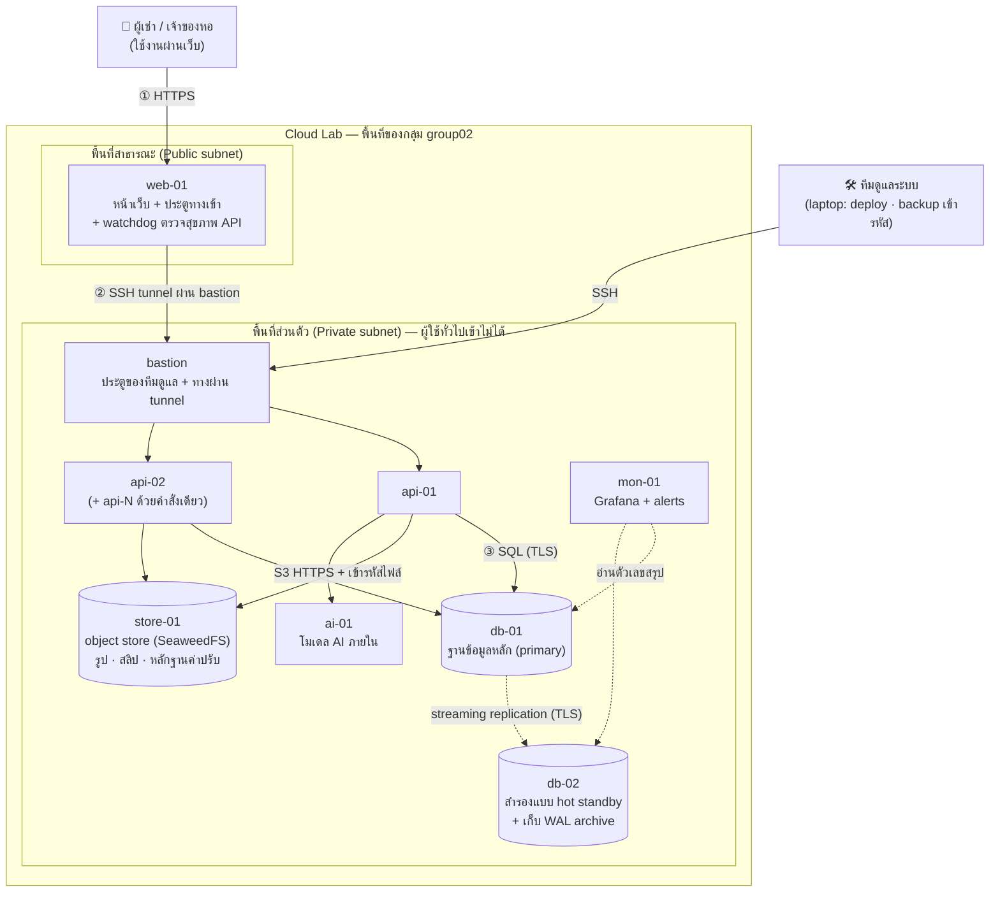

# DormDesk — System Architecture

> เอกสารนี้อธิบายว่าระบบ DormDesk วางอยู่บน cloud อย่างไร และปลอดภัยอย่างไร เขียนสำหรับคนที่ยังไม่เคยเห็นระบบมาก่อน อ่านตามลำดับได้เลย คำศัพท์เทคนิคมีคำอธิบายในหัวข้อ 3 · หัวข้อ 1–11 คือภาพรวม · หัวข้อ 12 คือรายละเอียดทางเทคนิค · หัวข้อ 13 คือวิธีตั้งค่าทุกเครื่อง (ใช้สร้างใหม่ถ้า Cloud Lab ถูก reset) · หัวข้อ 14 คือแผนทดสอบและหลักฐานที่ใช้ตอน Demo
>
> **เวอร์ชัน 2 (8 ต.ค. 2026):** เพิ่มฟีเจอร์ Spec v2 (บิล/สลิป/ใบเสร็จ/PromptPay, ค่าปรับ, ฟิตเนส/สระด้วย QR, จองห้องส่วนกลาง, ที่จอดรถ, เปลี่ยนผู้เช่า) · **db-02** hot standby + failover · **store-01** object store (SeaweedFS) · backup เข้ารหัส + PITR · Grafana alerts · boot hook · api-N auto-wiring · session ยกเลิกได้ · CI · load test — สรุปอยู่หัวข้อ 16 · เหตุผลของทุกการตัดสินใจและปัญหาที่เจอ อยู่ใน `DECISIONS.md`
>
> **เอกสารนี้คือแหล่งข้อมูลหลักด้านสถาปัตยกรรม** — `DormDesk_HANDOFF.md` และ `PROJECT_TRACKER.md` อ้างอิงตัวเลข IP พอร์ต และกฎ firewall จากที่นี่ ถ้าเปลี่ยนอะไร ให้แก้ที่นี่ก่อน

## 1. DormDesk คืออะไร

DormDesk คือเว็บสำหรับหอพัก ใช้ได้หลายหอพร้อมกันในระบบเดียว (เริ่มจากแจ้งซ่อม · v2 เพิ่มงานประจำวันของหอ)

- **ผู้เช่า** เปิดลิงก์ประจำห้องที่เจ้าของหอส่งให้ (ไม่ต้องสมัครสมาชิก): แจ้งซ่อม + รูป และติดตามสถานะ · ดูบิล สแกน PromptPay ส่งสลิป ได้ใบเสร็จ · ดู/โต้แย้งค่าปรับ · สแกน QR เข้าฟิตเนส/สระ · จองห้องส่วนกลาง · ขอที่จอดรถ/บัตรผู้มาเยือน
- **เจ้าของหอ** เข้าสู่ระบบ: จัดการคำขอ · ออกบิลรายเดือน (จดมิเตอร์) · ตรวจสลิป · ออกค่าปรับพร้อมรูปหลักฐาน · อนุมัติที่จอด · ตั้งค่าเปิด/ปิดฟีเจอร์ต่อหอ · เปลี่ยนผู้เช่า · ดูสรุปภาพรวม

สิ่งที่สำคัญที่สุดของระบบคือ **ข้อมูลของแต่ละหอต้องไม่ปนกัน** และ **คนนอกต้องเข้าถึงข้อมูลไม่ได้**

## 2. ภาพรวมระบบในหน้าเดียว



อ่านรูปนี้อย่างไร

- ระบบแบ่งเป็น 2 พื้นที่: **พื้นที่สาธารณะ** ที่คนภายนอกเข้าถึงได้ และ **พื้นที่ส่วนตัว** ที่คนภายนอกเข้าไม่ได้เลย
- ผู้ใช้เข้าได้ทางเดียวคือ **web-01** แล้ว web-01 ส่งคำขอต่อเข้าไปในพื้นที่ส่วนตัว
- ข้อมูลสำคัญทั้งหมดอยู่ใน **db-01** ซึ่งอยู่ลึกที่สุด และคุยได้เฉพาะกับเครื่องประมวลผล (api-01, api-02) · ทุกการเปลี่ยนแปลงถูกส่งต่อไป **db-02** ภายในเสี้ยววินาที ถ้า db-01 ล่มเปลี่ยนไปใช้ db-02 ได้ด้วยคำสั่งเดียว
- ไฟล์ (รูปแจ้งซ่อม สลิป หลักฐานค่าปรับ) อยู่ใน **store-01** แบบเข้ารหัส ไม่ใช่ในฐานข้อมูล
- ทีมดูแลระบบเข้าเครื่องต่างๆ ผ่าน **bastion** เท่านั้น
- **ข้อยกเว้นเดียวของพื้นที่ส่วนตัว** คือ bastion ที่แล็บเปิดพอร์ต 22002 ไว้ให้ ใช้ได้เฉพาะ SSH ต้องมีรหัสของกลุ่ม และเป็นทางเข้าของทีมดูแลเท่านั้น ไม่ใช่ทางเข้าของผู้ใช้ (บน cloud จริงเทียบได้กับ bastion host หรือ AWS SSM Session Manager)

## 3. คำศัพท์ที่ควรรู้

| คำศัพท์ | ความหมายแบบง่าย |
|---|---|
| Cloud Lab | ระบบ cloud จำลองของวิชา อาจารย์ใช้ server หนึ่งเครื่อง (45.77.40.35) แบ่งพื้นที่ให้แต่ละกลุ่มสร้างเครื่องของตัวเอง คล้าย AWS แบบย่อส่วน |
| Instance | "เครื่อง" หนึ่งเครื่องในระบบ (ใน Cloud Lab คือ container ที่ทำงานเหมือนคอมพิวเตอร์แยกกัน) |
| VPC | เครือข่ายส่วนตัวของกลุ่มเรา เครื่องของกลุ่มอื่นมองไม่เห็น |
| Subnet | ห้องย่อยในเครือข่าย · **Public** = คนนอกเข้าถึงได้ถ้าเปิดทางไว้ · **Private** = คนนอกเข้าไม่ได้เลย |
| IP | ที่อยู่ของเครื่องในเครือข่าย เช่น 10.0.2.10 |
| Port | ช่องทางเข้าของโปรแกรมในเครื่อง เช่น เว็บใช้ 443, ฐานข้อมูลใช้ 5432 |
| Port mapping | การเปิดช่องจากภายนอกให้ตรงเข้าเครื่องใดเครื่องหนึ่ง เช่น 45.77.40.35:10201 → web-01 |
| Firewall | กฎว่าใครต่อเข้า (และต่อออก) เครื่องนี้ได้บ้าง |
| Bastion | เครื่องประตูที่ทีมต้องผ่านก่อนเข้าไปดูแลเครื่องอื่น |
| HTTPS / TLS | การเข้ารหัสข้อมูลระหว่างเบราว์เซอร์กับเว็บ คนกลางทางอ่านไม่ได้ |
| API | โปรแกรมที่รับคำขอจากหน้าเว็บ ตรวจสิทธิ์ แล้วไปอ่าน/เขียนฐานข้อมูล |
| Load balancer | ตัวกระจายงานไปยังเครื่องหลายเครื่อง ถ้าเครื่องหนึ่งล่มก็ส่งไปอีกเครื่อง |
| Tenant | ลูกค้าหนึ่งราย ในที่นี้คือ **หอพักหนึ่งหอ** |

## 4. ส่วนประกอบของระบบ

| เครื่อง | อยู่ที่ | ทำหน้าที่อะไร | ทำไมต้องมี |
|---|---|---|---|
| **web-01** | พื้นที่สาธารณะ | แสดงหน้าเว็บ เข้ารหัส HTTPS และส่งคำขอต่อให้ API | เป็นประตูเดียวที่คนภายนอกเข้าได้ ทำให้คุมความปลอดภัยได้ที่จุดเดียว |
| **api-01** | พื้นที่ส่วนตัว | ประมวลผลคำขอ ตรวจว่าใครมีสิทธิ์ทำอะไร | ตรรกะของระบบไม่ควรอยู่ในเครื่องที่คนนอกเข้าถึงได้ |
| **api-02** | พื้นที่ส่วนตัว | ทำงานเหมือน api-01 | ถ้า api-01 ล่ม ระบบยังใช้งานได้ |
| **db-01** | พื้นที่ส่วนตัว | ฐานข้อมูลหลัก (primary) — หอ ห้อง ผู้เช่า คำขอ บิล ค่าปรับ การจอง | ข้อมูลอยู่ลึกที่สุด คุยได้เฉพาะกับ API |
| **db-02** | พื้นที่ส่วนตัว | hot standby: รับการเปลี่ยนแปลงจาก db-01 ตลอดเวลา (async streaming replication) + เก็บ WAL สำหรับกู้คืนย้อนเวลา (PITR) | ถ้า db-01 ล่ม เลื่อน db-02 ขึ้นเป็นหลักได้ใน ~40 วินาที · backup อ่านจากเครื่องนี้ ไม่กวนเครื่องหลัก |
| **store-01** | พื้นที่ส่วนตัว | SeaweedFS (S3 API) เก็บรูป สลิป หลักฐานค่าปรับ — ไฟล์ถูก API เข้ารหัส AES-256-GCM ก่อนส่ง | ไม่ให้ไฟล์ใหญ่ทำให้ฐานข้อมูล/backup/replication บวม · สลิปเป็นข้อมูลการเงินที่อ่อนไหว |
| **ai-01** | พื้นที่ส่วนตัว | โมเดลภาษาเล็ก (llama.cpp + Qwen3-0.6B) สำหรับ "ถาม AI" | ข้อมูลไม่ออกนอกแล็บ · ไม่มีขาออก |
| **mon-01** | พื้นที่ส่วนตัว | Grafana: เหตุการณ์ความปลอดภัย + สุขภาพระบบ + ตัวเลขธุรกิจ · **7 alerts ส่งอีเมล** | ให้ทีมรู้ก่อนผู้ใช้ว่ามีอะไรผิดปกติ |
| **bastion** | พื้นที่ส่วนตัว | ประตู SSH ของทีมดูแล (Cloud Lab สร้างไว้ให้) | ไม่ต้องเปิด SSH ของทุกเครื่องให้คนนอก |

รายชื่อเครื่องทั้งหมด (IP) อยู่ที่เดียวคือ `infra/topology.env` · config ของ Nginx, tunnel และ bastion ถูก **สร้างจากไฟล์นี้** (หัวข้อ 16.5)

## 5. ข้อมูลเดินทางอย่างไร

ตัวอย่าง: ผู้เช่าห้อง 305 แจ้งว่าแอร์เสีย

1. ผู้เช่าเปิดลิงก์ประจำห้อง ซึ่งพาไปที่ `https://45.77.40.35:10201` ข้อมูลที่ส่งถูกเข้ารหัสด้วย HTTPS
2. คำขอเข้ามาที่ **web-01** ซึ่งเป็นทางเข้าเดียวของระบบ
3. web-01 ส่งคำขอต่อไปที่ **api-01 หรือ api-02** (ตัวไหนว่างก็ได้)
4. API ดูจากลิงก์ว่าเป็นหอไหน ห้องไหน ตรวจว่าไม่ได้ส่งถี่ผิดปกติ แล้วบันทึกลง **db-01**
5. ผู้เช่าได้ลิงก์ติดตามสถานะกลับไป
6. เจ้าของหอเข้าสู่ระบบ เห็นคำขอนี้เฉพาะในหอของตัวเอง แล้วเปลี่ยนสถานะเป็น "กำลังดำเนินการ"

ตลอดเส้นทางนี้ **คนภายนอกไม่เคยคุยกับ API หรือฐานข้อมูลโดยตรง**

## 6. ระบบปลอดภัยอย่างไร

ระบบใช้หลัก **ป้องกันหลายชั้น** ถ้าชั้นหนึ่งพลาด ยังมีชั้นถัดไปกันไว้

| # | หลักการ | ทำอย่างไร |
|---|---|---|
| 1 | ประตูเข้าบานเดียว | จาก internet เข้าได้เฉพาะพอร์ต 10201 ที่ไปยัง web-01 เครื่องอื่นไม่มีทางเข้าจากภายนอก |
| 2 | แต่ละเครื่องคุยได้เฉพาะเครื่องที่จำเป็น | firewall กำหนดว่า web-01 คุยกับ API ได้ · API คุยกับฐานข้อมูลได้ · นอกนั้นปฏิเสธทั้งหมด |
| 3 | จำกัดขาออกด้วย | ถ้ามีคนยึดเครื่องได้ ก็ส่งข้อมูลออกไปข้างนอกไม่ได้ |
| 4 | ข้อมูลแต่ละหอไม่ปนกัน | กันไว้ 3 ชั้น: ลิงก์ห้องเป็นรหัสสุ่มเดาไม่ได้ · API ใช้หอจากบัญชีที่ login เท่านั้น · ฐานข้อมูลเองก็บังคับให้เห็นเฉพาะข้อมูลของหอนั้น (Row-Level Security) |
| 5 | เข้ารหัสข้อมูล | HTTPS (Let's Encrypt) ระหว่างผู้ใช้กับเว็บ · TLS ระหว่าง API↔ฐานข้อมูล, db-01↔db-02, API↔store-01 · ไฟล์ใน object store เข้ารหัส AES-256-GCM โดย API · backup เข้ารหัสบน laptop · รหัสผ่านเก็บแบบ hash |
| 6 | ให้สิทธิ์เท่าที่จำเป็น | บัญชีฐานข้อมูลของ API ไม่มีสิทธิ์ DELETE · Grafana อ่านได้แค่ view สรุป (ไม่เห็นชื่อ เบอร์ ทะเบียนรถ สลิป) · บัญชี replication อ่านตารางไม่ได้ · S3 มี 2 บัญชี: API (อ่าน/เขียน bucket เดียว) และ backup (อ่านอย่างเดียว) |
| 7 | ทีมเข้าผ่านประตูเดียว | SSH ได้เฉพาะผ่าน bastion |
| 8 | มองเห็นการโจมตี | บันทึก login ผิด, การส่งถี่ผิดปกติ, การพยายามดูข้อมูลหออื่น แล้วแสดงใน Grafana |
| 9 | กู้คืนได้ | สำรองทุกวัน (dump + ไฟล์ + WAL) ไปเก็บ **นอกแล็บ** แบบเข้ารหัส · ทุกครั้งทดสอบกู้คืนจริง · ซ้อม PITR ย้อนไปก่อนความผิดพลาด 1 วินาทีได้ |
| 11 | ข้อมูลผู้เช่าเก่าไม่หลุดถึงคนใหม่ | ทุกข้อมูลผูกกับ "การเช่า" (tenancy) · RLS ชั้นที่ 2 กรองตาม tenancy · เปลี่ยนผู้เช่า = รหัสห้องใหม่ ลิงก์เก่าตายทันที |
| 12 | ยกเลิก session ได้จริง | session เก็บเป็น hash ในฐานข้อมูล · หมดอายุเมื่อไม่ใช้ 2 ชม. / สูงสุด 8 ชม. · เจ้าของสั่ง "ออกจากระบบเครื่องอื่น" ได้ |
| 10 | ไม่พึ่งชั้นเดียว | แม้ firewall ของแล็บยังไม่ทำงาน แต่ละโปรแกรมก็จำกัดเองด้วย: PostgreSQL รับเฉพาะ IP ของ API/mon-01 (`pg_hba.conf`) · Grafana ไม่มีพอร์ตสาธารณะ · API ต้องผ่านการตรวจสิทธิ์ทุกคำขอ |

> ✅ ข้อ 2 และ 3 บังคับใช้แล้วด้วย iptables ในแต่ละเครื่อง (`infra/firewall/rules.sh`) — Console ของแล็บใช้ไม่ได้เพราะบั๊กชื่อเครื่อง เราจึงตั้งกฎชุดเดียวกันเอง · กฎถูกตั้งใหม่อัตโนมัติทุกครั้งที่เครื่อง restart (boot hook) · ผลตรวจ `tools/verify.sh` **48/48** (8 ต.ค. 2026) อยู่ใน `evidence/`

## 7. ถ้าเกิดเหตุการณ์ต่อไปนี้ ระบบรับมืออย่างไร

| เหตุการณ์ | ผลที่เกิดขึ้น |
|---|---|
| api-01 ล่ม | Nginx ส่งซ้ำไป api-02 · watchdog บน web-01 ตัด api-01 ออกภายใน ~10 วินาที · เมื่อแล็บเปิดเครื่องกลับมา boot hook สตาร์ต API เอง และ watchdog ใส่กลับ |
| แฮกเกอร์ยึด web-01 ได้ | คุยได้แค่ API ซึ่งต้องผ่านการตรวจสิทธิ์ · ต่อฐานข้อมูลตรงๆ ไม่ได้ · ส่งข้อมูลออกนอกระบบไม่ได้ |
| มีคนสุ่มลิงก์ห้องเพื่อดูข้อมูลห้องอื่น | ลิงก์เป็นรหัสสุ่มยาว เดาไม่ได้ และถ้าลองผิดบ่อยจะถูกจำกัดและบันทึกไว้ |
| โค้ด API มีบั๊ก ลืมกรองหอ | ฐานข้อมูลยังบังคับให้เห็นเฉพาะหอของผู้ใช้ ข้อมูลไม่รั่ว |
| มีคนยิงคำขอปลอมจำนวนมาก | ถูกจำกัดจำนวนคำขอ (rate limit) ทั้งที่ web-01 และ API |
| ลิงก์ห้องหลุดไปถึงคนอื่น | เจ้าของหอเปลี่ยนรหัสห้องได้ทันที ลิงก์เก่าใช้ไม่ได้ |
| db-01 ล่ม | ทีมรัน `infra/db/failover.sh` → db-02 เป็นหลัก · API หาเครื่องหลักใหม่เอง (multi-host DSN) · วัดจริง: ใช้งานได้อีกครั้งใน ~35 วินาที · ข้อมูลที่อาจหายคือรายการในวินาทีสุดท้าย (async) |
| db-01 กลับมาหลัง failover | boot hook ถามเครื่องคู่ว่าเป็นหลักอยู่ไหม → ถ้าใช่ **กันตัวเอง** (firewall + read-only) ก่อน PostgreSQL เริ่ม · ไม่เกิด split-brain · แล้ว `rejoin.sh` สร้างเป็น standby ใหม่ |
| store-01 ล่ม | ส่วนอื่นยังใช้งานได้ · อัปโหลด/ดูรูปและสลิปตอบ 503 ชั่วคราว · ไฟล์มีสำรองบน laptop |
| ลบ/แก้ข้อมูลผิด | กู้คืนแบบย้อนเวลา (PITR) ไปก่อนเกิดเหตุได้ใกล้ระดับวินาที จาก base backup + WAL บน laptop |
| แล็บ restart เครื่อง | ทุกเครื่องตั้ง firewall และสตาร์ตบริการของตัวเองใหม่ (boot hook) ไม่ต้องรอทีม |
| web-01 ล่ม | ระบบหยุดชั่วคราว — ยังเป็น **จุดเสี่ยงจุดเดียว** (แล็บให้ port mapping ไปเครื่องเดียว) สร้างใหม่ด้วย `infra/deploy.sh web` · บน cloud จริงใช้ load balancer หลายโซน |
| แล็บถูก reset ทั้งหมด | สร้างใหม่ตามหัวข้อ 13 จากโค้ดใน git + ไฟล์สำรองที่เก็บนอกแล็บ |

**ทำไม failover ฐานข้อมูลเป็นแบบสั่งด้วยมือ (คำสั่งเดียว)** — มีฐานข้อมูล 2 เครื่อง ถ้าให้สลับเองอัตโนมัติ เครื่องแยกไม่ออกว่า "อีกเครื่องตาย" หรือ "เน็ตขาดระหว่างกัน" อาจเกิดเครื่องหลัก 2 ตัวพร้อมกัน (split-brain) · การสลับอัตโนมัติที่ปลอดภัยต้องมีผู้ลงคะแนนตัวที่ 3 (Patroni + etcd) ซึ่งเกินทรัพยากรของแล็บ — รายละเอียดใน `DECISIONS.md` D10

## 8. ตอบโจทย์ของวิชาอย่างไร

| ข้อกำหนดของวิชา | DormDesk |
|---|---|
| ต้องมี public subnet และ private subnet | web-01 อยู่ public · API, ฐานข้อมูล และเครื่องอื่นอยู่ private |
| หน้าเว็บอยู่ใน public subnet | web-01 |
| REST API อยู่ใน private subnet | api-01, api-02 |
| เปิดพอร์ตสู่ internet เท่าที่จำเป็น | ระบบของเราเปิดพอร์ตเดียว (10201 → HTTPS) · ไม่เปิด HTTP · SSH ใช้ประตูของแล็บ (22002 → bastion) ซึ่งเป็นทางเข้าของทีมดูแล ไม่ใช่ของผู้ใช้ |

## 9. เลือกใช้อะไร และทำไม

| ส่วน | ใช้อะไร | เหตุผลแบบสั้น |
|---|---|---|
| Cloud | Cloud Lab ของวิชา | เป็นแพลตฟอร์มที่ใช้ประเมิน และให้เราควบคุมเครือข่ายกับ firewall เอง |
| หน้าเว็บ + ประตูทางเข้า | Nginx | เบา ทำได้หลายอย่างในตัวเดียว (หน้าเว็บ, HTTPS, ส่งต่อคำขอ, กระจายงาน, จำกัดคำขอ) |
| เครื่อง API | Ubuntu 24.04 | ได้อัปเดตความปลอดภัยระยะยาว ติดตั้งโปรแกรมง่าย มีคู่มือเยอะ |
| ภาษา / framework ของ API | Python + FastAPI | ตรวจรูปแบบข้อมูลขาเข้าให้อัตโนมัติ ลดช่องโหว่ และเขียนเร็ว |
| ฐานข้อมูล | PostgreSQL | ข้อมูลมีความสัมพันธ์ชัดเจน และมี Row-Level Security สำหรับแยกข้อมูลแต่ละหอ |
| หน้าจอเฝ้าระวัง | Grafana | มีในแล็บ ต่อฐานข้อมูลได้ทันที ไม่ต้องเขียนหน้าจอเอง |
| HTTPS | Let's Encrypt (DNS-01 ผ่าน DuckDNS) | โดเมนฟรี + ใบรับรองที่เบราว์เซอร์เชื่อถือ โดยไม่ต้องเปิดพอร์ต 80 |
| รหัสผ่านผู้ใช้ | bcrypt | เก็บแบบ hash ถ้าฐานข้อมูลหลุดก็ถอดรหัสผ่านกลับได้ยาก |
| สำรองข้อมูล | pg_dump + pg_basebackup + WAL archive · openssl AES-256 | dump กู้ง่าย · base + WAL ย้อนเวลาได้ · เข้ารหัสก่อนเก็บนอกแล็บ |
| ฐานข้อมูลสำรอง | PostgreSQL streaming replication (async) | มีในตัว ไม่ต้องลงโปรแกรมเพิ่ม · async ไม่ทำให้การเขียนช้าและไม่หยุดเมื่อ standby ล่ม |
| Object store | SeaweedFS (S3 API) | MinIO community ถูก archive แล้ว (2026) · SeaweedFS เป็น Apache-2.0 ไฟล์เดียว ใช้ RAM ~110 MB |
| CI | GitHub Actions | ทุก push รันฐานข้อมูล + object store + API จริง แล้วทดสอบ 93 ข้อ |
| Load test | k6 | เขียนสคริปต์ง่าย วัด p95 ได้ · ใช้เปรียบเทียบ 1 vs 2 vs 3 API |

สิ่งที่ **ไม่ใช้**: เปิดพอร์ตให้ API หรือฐานข้อมูลโดยตรง (ผิดโจทย์และอันตราย) · HTTP ธรรมดา (ไม่เข้ารหัส) · CORS (ไม่จำเป็นเพราะหน้าเว็บกับ API ใช้ทางเข้าเดียวกัน)

## 10. สถานะปัจจุบันบน Cloud Lab

ตรวจเมื่อ 8 ต.ค. 2026 (v2) — ประวัติ v1 (27 ก.ย.) อยู่ใน `PROJECT_TRACKER.md`

**เครื่องที่สร้างแล้ว (ทำงานอยู่ทั้งหมด)**

| เครื่อง | ซอฟต์แวร์ | IP | พื้นที่ | CPU / RAM | role (firewall) |
|---|---|---|---|---|---|
| web-01 | Nginx + SSH tunnel + watchdog | 10.0.2.10 | public | 0.25 / 128 MB | web |
| api-01 | Ubuntu 24.04 · FastAPI 2.0.0 | 10.0.2.140 | private | 0.5 / 512 MB | api |
| api-02 | Ubuntu 24.04 · FastAPI 2.0.0 | 10.0.2.141 | private | 0.5 / 256 MB | api |
| db-01 | PostgreSQL 16.14 (primary) | 10.0.2.150 | private | 0.5 / 512 MB | db |
| db-02 | PostgreSQL 16 (hot standby + WAL archive) | 10.0.2.151 | private | 0.5 / 256 MB | db |
| store-01 | SeaweedFS 4.48 (S3, HTTPS) | 10.0.2.155 | private | 0.25 / 256 MB | store |
| ai-01 | llama.cpp + Qwen3-0.6B | 10.0.2.160 | private | 1 / 1 GB | ai |
| mon-01 | Grafana 13.1 | 10.0.2.165 | private | 0.5 / 512 MB | mon |
| bastion | (แล็บสร้างให้) | 10.0.2.3 / 10.0.2.131 | ทั้งสอง | – | – |

**ผลการตรวจ (หลักฐานใน `evidence/`)**

| เรื่อง | ผล |
|---|---|
| Network + firewall + ฐานข้อมูล + object store (`tools/verify.sh`) | ✅ **48/48** (`verify_2026-10-08.txt`) |
| เส้นทางหลัก v1 (`tools/smoke_test.py`) | ✅ 16/16 |
| ฟีเจอร์ v2 ทั้งหมดผ่าน Nginx จริง (`tools/flow_test.py --lab`) | ✅ 77/77 — tenancy, บิล/สลิป/ใบเสร็จ, ค่าปรับ, ที่จอด, การจอง, check-in, idempotency, แยกหอ/แยกผู้เช่า, feature switch, session |
| API ล่ม → ใช้งานต่อได้ · เปิดกลับมาเอง | ✅ (`A9_api_failover_selfheal_2026-10-08.txt`) |
| db-01 ล่ม → failover → db-01 กันตัวเอง → rejoin → สลับกลับแบบไม่เสียข้อมูล | ✅ ~35 วินาที (`A11_db_failover_2026-10-08.txt`) |
| backup + ทดสอบกู้คืน + PITR | ✅ จำนวนแถวตรงกันทุกตาราง · `PITR_OK` (`A12_backup_pitr_2026-10-08.txt`) |
| เพิ่ม/ลด API ด้วยคำสั่งเดียว | ✅ api-03 (`api_scale_out_2026-10-08.txt`) |
| Load test 1 / 2 / 3 API | ✅ +32 % throughput เมื่อมี 2 API · ตัวที่ 3 ไม่ช่วยเพราะฐานข้อมูลเต็ม (`loadtest_summary_2026-10-08.txt`) |
| Grafana alerts → อีเมล | ✅ 7 กฎ · ทดสอบส่งอีเมลสำเร็จ |
| ข้อจำกัดของแล็บที่ยังอยู่ | public ↔ private ข้าม subnet ไม่ได้ (ใช้ tunnel หัวข้อ 12.12) · Console Firewall ใช้ไม่ได้ (บั๊กชื่อเครื่อง) · Console สร้างรหัส root เอง · "Edit" = สร้างเครื่องใหม่ |

## 11. ข้อจำกัดของ Cloud Lab

| ใน Cloud Lab | บน cloud จริง (เช่น AWS) จะทำแบบนี้ |
|---|---|
| ไม่มีโดเมน ใช้ใบรับรอง HTTPS ที่สร้างเอง (เครื่องที่ไม่ได้ติดตั้งจะเห็นคำเตือน) | ใช้ใบรับรองสาธารณะที่ Load Balancer |
| Firewall ต้องพึ่งโปรแกรมในแต่ละเครื่อง | Security Group ทำงานนอกเครื่อง ไม่ขึ้นกับ OS |
| กฎ Firewall อ้างอิงเป็น IP | อ้างอิงเป็นกลุ่มเครื่อง (Security Group) |
| ฐานข้อมูล 2 เครื่อง สลับด้วยคำสั่ง (manual failover) | บริการฐานข้อมูลที่สลับอัตโนมัติหลายโซน (เช่น RDS Multi-AZ) |
| Object store เครื่องเดียว (SeaweedFS) + สำรองบน laptop | S3 ที่เก็บซ้ำหลายโซนในตัว |
| Backup ดึงไปเก็บบน laptop ของทีม | backup อัตโนมัติไปอีก region |
| ไม่มี systemd — ใช้ boot hook ใน entrypoint ของแล็บ | VM/Container service ที่ restart บริการเองได้ |
| Port mapping ของแล็บอาจทำให้เห็น IP ผู้ใช้เป็น IP ของ server แล็บ | Load Balancer ส่ง IP จริงมาใน `X-Forwarded-For` เสมอ |
| web-01 เครื่องเดียว | Load Balancer ที่กระจายหลาย Availability Zone |
| Bastion ที่เปิดพอร์ต SSH | AWS SSM Session Manager (ไม่ต้องเปิดพอร์ตเลย) |
| public ↔ private subnet ต่อกันไม่ได้ ต้องใช้ SSH tunnel ผ่าน bastion | Route table ใน VPC เดียวกันต่อกันได้เอง + Security Group กำหนดว่าใครคุยกับใครได้ |

## 12. รายละเอียดทางเทคนิค

หัวข้อนี้ขยายความจากภาพรวมด้านบน ว่าแต่ละส่วนทำงานจริงอย่างไร

### 12.1 Network ทำงานอย่างไร

- **VPC ของกลุ่ม** คือช่วง IP `10.0.2.0/24` (256 ที่อยู่) แบ่งครึ่งเป็น 2 subnet ขนาด `/25` (subnet ละ 128 ที่อยู่)

| Subnet | ช่วง IP | Gateway | ความหมาย |
|---|---|---|---|
| group02-public | 10.0.2.0 – 10.0.2.127 | 10.0.2.1 | เปิดทางจากภายนอกได้ด้วย port mapping |
| group02-private | 10.0.2.128 – 10.0.2.255 | 10.0.2.129 | ไม่มีทางเข้าจากภายนอก |

- **ทุกเครื่องเป็น Docker container** ที่รันบน server ของ Cloud Lab (45.77.40.35) และต่อเข้ากับ network ของ subnet ที่เลือกตอนสร้าง เครื่องต่าง subnet คุยกันผ่าน gateway
- **Port mapping** คือ server ของแล็บรับการเชื่อมต่อที่พอร์ตหนึ่ง แล้วส่งต่อเข้าเครื่องในวง (NAT) เช่น `45.77.40.35:10201` → `web-01:443` · พอร์ตที่ไม่ได้ map ไว้จะไม่มีทางเข้าเลย · กลุ่มเราใช้ได้ช่วง 10200–10299
- **ขาออกไป internet** ทั้งสอง subnet ออกได้ผ่าน server ของแล็บ ระบบของเราจึงต้องจำกัดขาออกด้วยกฎ firewall เอง
- **Bastion** เข้าจากภายนอกผ่าน `45.77.40.35:22002` → `bastion:22` แล้ว SSH ต่อไปยังเครื่องอื่นด้วย IP ภายใน — เป็นพอร์ตเดียวที่เข้าถึง private subnet จากภายนอกได้ และแล็บเป็นผู้เปิด ไม่ใช่ระบบของเรา

### 12.2 คำขอหนึ่งครั้งผ่านอะไรบ้าง

| ขั้น | เกิดที่ | รายละเอียด |
|---|---|---|
| 1 | Browser → server แล็บ | เปิด TCP ไปที่ `45.77.40.35:10201` แล็บส่งต่อไปที่ `web-01:443` |
| 2 | web-01 (Nginx) | ทำ TLS handshake (TLS 1.2/1.3) ด้วยใบรับรองของ IP `45.77.40.35` แล้วถอดรหัสคำขอ |
| 3 | web-01 (Nginx) | ตรวจเบื้องต้น: method ที่อนุญาต · ขนาดข้อมูลไม่เกิน 5 MB · จำนวนคำขอต่อ IP · ถ้าเป็นไฟล์หน้าเว็บก็ส่งกลับเลย ถ้าเป็น `/api/*` ส่งต่อ |
| 4 | web-01 → api | ส่งต่อผ่าน SSH tunnel (`127.0.0.1:8001` → api-01:8000, `127.0.0.1:8002` → api-02:8000 ผ่าน bastion) แบบ round-robin พร้อมแนบ IP จริงของผู้ใช้ใน `X-Real-IP` · ดูหัวข้อ 12.12 |
| 5 | api (FastAPI) | ตรวจรูปแบบข้อมูลขาเข้า (Pydantic) · ระบุตัวตน: ผู้เช่าจากรหัสห้องในลิงก์ · เจ้าของหอจาก session cookie · ตรวจสิทธิ์ต่อหอ |
| 6 | api → db-01 | เปิด transaction ไปที่ `db-01:5432` แบบเข้ารหัส (TLS) ด้วยบัญชี `dormdesk_app` · ตั้ง `app.dorm_id` เป็นหอของผู้ใช้ด้วย `SET LOCAL` (มีผลเฉพาะ transaction นี้ ไม่ค้างไปถึงคำขอถัดไปที่ใช้ connection เดียวกัน) · รัน SQL แบบ parameterized · Row-Level Security กรองให้เหลือเฉพาะข้อมูลหอนั้น |
| 7 | ย้อนกลับ | API ตอบเป็น JSON → Nginx เข้ารหัสกลับ → Browser · ถ้ามีเหตุผิดปกติ API บันทึกลง `security_events` |

### 12.3 ข้อมูลที่เก็บในฐานข้อมูล

ทุกตารางที่เป็นข้อมูลของลูกค้ามีคอลัมน์ `dorm_id` เพื่อบอกว่าเป็นของหอไหน

| ตาราง | เก็บอะไร |
|---|---|
| dorms | หอพัก |
| admins · admin_dorms | บัญชีเจ้าของหอ (รหัสผ่านแบบ hash) และหอที่แต่ละบัญชีดูแล |
| rooms | ห้อง + รหัสประจำห้อง (สุ่ม) |
| categories · dorm_categories | หมวดปัญหา และหมวดที่แต่ละหอเปิดใช้ |
| requests | คำขอแจ้งซ่อม: หมวด รายละเอียด ผู้แจ้ง สถานะ ความเร่งด่วน รหัสติดตาม (สุ่ม) |
| request_photos | รูปที่แนบ (เก็บเป็นข้อมูลในฐานข้อมูล) |
| request_events | ประวัติการเปลี่ยนสถานะทุกครั้ง (audit trail) |
| security_events | เหตุการณ์ด้านความปลอดภัย สำหรับ Grafana |
| **v2:** tenancies | การเช่าแต่ละครั้งของห้อง (ทุกข้อมูลผู้เช่าผูกกับ tenancy) |
| **v2:** dorm_settings · facilities | สวิตช์ฟีเจอร์ + กติกาต่อหอ · ฟิตเนส/สระ/ห้องส่วนกลาง (QR token) |
| **v2:** checkins · bookings · booking_bans · booking_quota_extra | เข้าใช้ด้วย QR · การจอง (EXCLUDE ห้ามทับเวลา) · งดจองเมื่อไม่มาครบ N ครั้ง |
| **v2:** parking_permits · parking_waitlist · guest_passes | ที่จอดรถ · คิวรอ · บัตรผู้มาเยือน |
| **v2:** bills · bill_lines · bill_edits · bill_slips · meter_readings · dorm_counters | บิลรายเดือน (เงินเป็นสตางค์) · ประวัติแก้ไข · สลิป · มิเตอร์ · เลขใบเสร็จไม่ข้ามเลข |
| **v2:** fines · fine_photos · messages | ค่าปรับ + หลักฐาน · ข้อความโต้ตอบของบิล/ค่าปรับ/ที่จอด |
| **v2:** objects | metadata ของไฟล์ใน store-01 (key, ขนาด, sha256, key id ที่ใช้เข้ารหัส) — ตัวไฟล์ไม่อยู่ในฐานข้อมูล |
| **v2:** idem_keys · notifications | กันการสร้างซ้ำเมื่อ retry · อีเมลส่งครั้งเดียวต่อเหตุการณ์ |
| **v2:** admin_sessions | session ของเจ้าของ (เก็บ hash) ยกเลิกได้ |
| **v2:** api_heartbeats · job_state · ops_meta | สุขภาพ API · งานเบื้องหลัง · วันหมดอายุใบรับรอง / backup ล่าสุด (ให้ Grafana alert) |

### 12.4 REST API

endpoint หลักของ v1 ด้านล่าง · รายการเต็ม (รวม v2) อยู่ใน `DormDesk_HANDOFF.md` ข้อ 8 · v2 แยกเป็น `api/app/tenant.py` (ผู้เช่า `/api/rooms/{code}/...`), `admin_features.py` (เจ้าของ), `auth.py` (session)

| Method | Path | ใครใช้ | ทำอะไร |
|---|---|---|---|
| GET | /api/health | – | ตรวจว่า API ทำงาน |
| GET | /api/rooms/{roomCode} | ผู้เช่า | ข้อมูลหอ/ห้อง และหมวดที่เปิด |
| POST | /api/rooms/{roomCode}/requests | ผู้เช่า | แจ้งปัญหา ได้รหัสติดตามกลับ |
| GET | /api/track/{token} | ผู้เช่า | ดูสถานะและประวัติ |
| POST | /api/auth/login | เจ้าของหอ | เข้าสู่ระบบ |
| GET | /api/admin/dorms | เจ้าของหอ | หอที่ตัวเองดูแล |
| GET | /api/admin/dorms/{id}/requests | เจ้าของหอ | รายการคำขอ กรองตามสถานะ/หมวด |
| PATCH | /api/admin/requests/{id} | เจ้าของหอ | เปลี่ยนสถานะ / ความเร่งด่วน |
| GET | /api/admin/dorms/{id}/dashboard | เจ้าของหอ | ตัวเลขสรุป |
| POST | /api/admin/rooms/{id}/rotate-code | เจ้าของหอ | ออกรหัสห้องใหม่ |

### 12.5 การยืนยันตัวตนและการแยกข้อมูลแต่ละหอ

- **ผู้เช่า (ไม่มีบัญชี):** ลิงก์ห้องมีรหัสสุ่มยาว 128 bit · API เรียกฟังก์ชัน `resolve_room(code)` ในฐานข้อมูลเพื่อหาว่าเป็นหอ/ห้องไหน แล้วใช้หอนั้นตลอดคำขอ · ผู้เช่าเลือกหอเองไม่ได้
- **เจ้าของหอ:** login ด้วยอีเมล + รหัสผ่าน (ตรวจกับ hash แบบ bcrypt) → ได้ session token แบบสุ่ม เก็บใน cookie แบบ `HttpOnly; Secure; SameSite=Strict` · ฐานข้อมูลเก็บเฉพาะ **sha256** ของ token (`admin_sessions`) → logout/ยกเลิกได้จริง · หมดอายุเมื่อไม่ใช้ 2 ชม. และสูงสุด 8 ชม. · หน้า Settings แสดงอุปกรณ์ที่ login อยู่และ "ออกจากระบบเครื่องอื่น" · ทุกคำขอ API ตรวจว่าบัญชีนี้ดูแลหอที่ขอจริง
- **ผู้เช่าคนละรอบในห้องเดียวกัน (v2):** RLS ชั้นที่ 2 แบบ RESTRICTIVE กรองด้วย `app.tenancy_id` บนตารางของผู้เช่าทุกตาราง (คำขอ บิล ค่าปรับ การจอง ที่จอด ข้อความ) · API ตั้งค่าทั้ง `app.dorm_id` และ `app.tenancy_id` ด้วย `SET LOCAL` · หน้าเจ้าของใช้ `dorm_scope()` ยกเฉพาะชั้น tenancy (ยังจำกัดหอเสมอ)
- **Row-Level Security:** ฐานข้อมูลกรองทุกคำสั่งด้วยค่า `app.dorm_id` ที่ API ตั้งไว้ ถ้าไม่ได้ตั้งจะได้ 0 แถว จึงปลอดภัยแม้โค้ดลืมกรอง
- **ข้อควรระวังที่ทำให้ RLS ไม่ทำงานโดยไม่รู้ตัว** (ตั้งตามภาคผนวก C):
  - เจ้าของตาราง (table owner) และ superuser ข้าม RLS ได้ → ตารางเป็นของ `postgres` ส่วน `dormdesk_app` ไม่ใช่เจ้าของ ไม่มีสิทธิ์ `BYPASSRLS` และทุกตารางตั้ง `FORCE ROW LEVEL SECURITY`
  - ก่อนรู้ว่าเป็นหอไหน (เปิดลิงก์ห้อง / ลิงก์ติดตาม) ใช้ฟังก์ชัน `resolve_room(code)` และ `resolve_tracking(token)` แบบ `SECURITY DEFINER` ที่คืนเฉพาะ `dorm_id`/`room_id` ของรหัสนั้น ไม่เปิดตารางให้อ่านทั้งหมด
  - เจ้าของที่ดูแลหลายหอ: ตั้ง `app.dorm_id` ทีละหอตามที่เลือก หลังตรวจกับ `admin_dorms` แล้ว

### 12.6 Firewall ทำงานอย่างไร

- ตั้งแยกทีละเครื่องในหน้า Firewall ของ Console ทั้ง **ขาเข้า (Ingress)** และ **ขาออก (Egress)**
- หลักการคือ **ปฏิเสธทุกอย่าง แล้วเปิดเฉพาะที่จำเป็น** (default deny)
- เป็นแบบ **stateful**: ถ้าอนุญาตให้การเชื่อมต่อเข้ามาแล้ว การตอบกลับจะผ่านได้เองโดยไม่ต้องตั้งกฎขาออกเพิ่ม
- ต้นทางกำหนดเป็นช่วง IP (CIDR) ได้ เช่น `10.0.2.136/29` หมายถึง 10.0.2.136–10.0.2.143 (โซน app)
- Console ใช้ iptables ภายในแต่ละเครื่องในการบังคับกฎ (รายการกฎทั้งหมดอยู่ในภาคผนวก B)

### 12.7 การเข้ารหัสและการเก็บความลับ

| ส่วน | วิธี |
|---|---|
| Browser ↔ web-01 | HTTPS · TLS 1.2/1.3 · ใบรับรอง Let's Encrypt ของ `dormdesk-g02.duckdns.org` · HTTP ถูก redirect · Grafana เตือนก่อนหมดอายุ 14 วัน |
| API ↔ db-01/db-02 | PostgreSQL TLS · pg_hba บังคับ `hostssl` + scram-sha-256 |
| db-01 ↔ db-02 (replication) | TLS · บัญชี `dormdesk_repl` (สิทธิ์ REPLICATION อย่างเดียว อ่านตารางไม่ได้) |
| API ↔ store-01 | HTTPS ด้วยใบรับรองจาก CA ของทีม (API ตรวจด้วย `S3_CA_FILE`) · พอร์ต HTTP ธรรมดาถูก firewall ปิด |
| ไฟล์ใน object store | API เข้ารหัส **AES-256-GCM** ก่อนส่ง (AAD = ชื่อไฟล์) · กุญแจอยู่ใน `.env` ของ API (`OBJ_KEYS`, หมุนกุญแจได้ด้วย key id) |
| Backup บน laptop | `openssl enc -aes-256-cbc -pbkdf2` ด้วย `BACKUP_PASSPHRASE` · ทุกไฟล์ใน `backups/` เข้ารหัส |
| รหัสผ่านเจ้าของหอ | bcrypt (hash แบบช้า ป้องกันการเดาย้อนกลับ) |
| รหัสฐานข้อมูล / S3 / กุญแจเข้ารหัสไฟล์ | อยู่ในไฟล์ `/srv/dormdesk/.env` บน api เท่านั้น (สิทธิ์ 600 ไม่เข้า git) · ต้นฉบับใน `secrets.env` ของทีม |
| รหัสเข้าเครื่องทั้งหมด | เก็บแยกในไฟล์ `cloud_pass.txt` ของทีม ไม่อยู่ในเอกสารนี้ |

### 12.8 การป้องกันการใช้งานผิดปกติ

| กลไก | ค่าที่ตั้ง |
|---|---|
| จำกัดการแจ้งปัญหา (หลัก) | 5 เรื่อง / 10 นาที **ต่อห้อง** (API นับจากฐานข้อมูล) — ผูกกับรหัสห้อง จึงไม่กระทบห้องอื่นที่ใช้ Wi-Fi เดียวกัน |
| จำกัดการแจ้งปัญหา (ชั้นนอก) | 30 เรื่อง / 10 นาที ต่อ IP (Nginx) — ตั้งหลวมกว่า เพราะผู้เช่าทั้งหอมักออก internet ด้วย IP เดียวกัน |
| จำกัดการ login | 5 ครั้ง / นาที ต่อ IP |
| จำกัดคำขอ API ทั่วไป | 10 ครั้ง / วินาที ต่อ IP (ยอมให้เกินชั่วคราว 20) |
| ขนาดข้อมูลที่ส่งได้ | ไม่เกิน 5 MB |
| รูปที่อัปโหลด | รับเฉพาะ jpg / png / webp · แปลงไฟล์ใหม่เพื่อลบข้อมูลแฝง (EXIF เช่นพิกัด GPS) |
| Security headers | `X-Content-Type-Options`, `X-Frame-Options`, `Referrer-Policy: no-referrer` (กันรหัสห้อง/รหัสติดตามใน URL รั่วไปเว็บอื่น) · ซ่อนเวอร์ชันของ Nginx |
| Log | access log ของ Nginx ตัดรหัสห้องและรหัสติดตามออกจาก path ก่อนบันทึก |

**ต้องตรวจก่อนเชื่อค่า rate limit ต่อ IP:** port mapping ของแล็บอาจแปลง IP ต้นทาง (NAT) ทำให้ Nginx เห็นทุกคนเป็น IP ของ server แล็บ ทดสอบโดยเปิดเว็บจาก 2 เครือข่าย (Wi-Fi มหาวิทยาลัย และ hotspot มือถือ) แล้วดู `$remote_addr` ใน access log · ถ้าเห็นเป็น IP เดียวกัน ให้ปิด limit ต่อ IP และพึ่ง limit ต่อห้อง + ต่อบัญชี login แทน แล้วบันทึกเป็นข้อจำกัดในหัวข้อ 11

### 12.9 การทำงานต่อเมื่อเครื่องล่ม (High Availability)

**ชั้น API**
- Nginx มีรายชื่อ API ทุกเครื่อง (สร้างจาก `topology.env`) · คำขอที่ล้มเหลวถูกส่งซ้ำไปอีกเครื่อง **รวมถึง POST/PATCH/PUT** (`proxy_next_upstream ... non_idempotent`) — ปลอดภัยเพราะทุกคำขอเขียนจากหน้าเว็บมี `Idempotency-Key`: การสร้างบันทึก key ใน transaction เดียวกับข้อมูล (`idem_keys`) และตั้งแต่ v2.1 middleware (`api/app/idempotency.py`, ตาราง `http_idem` ในฐานข้อมูลกลาง) จดคำตอบของทุก POST/PATCH/PUT — key เดิมส่งซ้ำไม่ว่าไป API เครื่องไหนก็ได้คำตอบเดิม ไม่บันทึกซ้ำ · หน้าเว็บส่งซ้ำเองด้วย key เดิมเมื่อได้ 502/503/504 · API รัน 1 process ต่อเครื่อง (`--workers 1`) เพราะ supervisor ของ uvicorn ฆ่า worker บน CPU 0.5 vCPU — D19
- **watchdog บน web-01 = active health check** (Nginx ฟรีไม่มี): ทุก 5 วินาทีเรียก `/api/health` ของทุก API ผ่าน tunnel · พลาด 2 ครั้งติด → ใส่ `down` ใน upstream (ไม่มีคำขอไปรอเครื่องที่ตาย) · กลับมาตอบ → ใส่กลับ · ถ้าไม่มี API ไหนตอบเลย ~60 วินาที → ต่อ tunnel ใหม่ · `proxy_read_timeout 15s`
- ทำได้เพราะ API **ไม่เก็บสถานะในเครื่อง**: session อยู่ในฐานข้อมูล · ไฟล์อยู่ใน store-01 · งานเบื้องหลังใช้ advisory lock (เครื่องไหนก็ทำแทนกันได้)

**ชั้นฐานข้อมูล (v2)**
- db-01 → db-02 แบบ **asynchronous streaming replication** ผ่าน replication slot (`standby_151`) · `max_slot_wal_keep_size = 2GB` (standby ตายนานก็ไม่ทำให้ดิสก์ของเครื่องหลักเต็ม) · `hot_standby_feedback = on`
- API ใช้ **multi-host DSN** `host=10.0.2.150,10.0.2.151 … target_session_attrs=read-write connect_timeout=3 tcp_user_timeout=8000` → ต่อกับเครื่องที่เขียนได้เองเสมอ ไม่ต้อง restart API หลัง failover
- **failover** (`infra/db/failover.sh`): ตรวจ standby → กัน (fence) เครื่องหลักเก่าถ้ายังติดต่อได้ (firewall `db-fenced` ปฏิเสธ 5432 + `default_transaction_read_only`) → `pg_promote()` → สลับ `topology.env` + DSN + Grafana data sources → smoke test · `--planned` = รอจน standby ได้ทุก transaction แล้วค่อยสลับ (ไม่เสียข้อมูล)
- **กัน split-brain ตอนเครื่องเก่าฟื้น:** boot hook ถามเครื่องคู่ก่อน PostgreSQL เริ่ม ถ้าเครื่องคู่เป็นหลักอยู่แล้ว → fence ตัวเอง · จากนั้น `infra/db/rejoin.sh` คัดลอกใหม่จากเครื่องหลัก (ไม่ใช้ข้อมูลเก่าซ้ำ เพราะอาจมี transaction ที่เครื่องใหม่ไม่เคยเห็น)
- **ทำไม PostgreSQL ต้องใช้ staging directory:** ใน container ของแล็บ PostgreSQL เป็น PID 1 หยุดไม่ได้โดยไม่ปิดเครื่อง → `pg_basebackup` ลงโฟลเดอร์รอไว้ แล้ว boot hook สลับเข้าตอน console restart

**ทุกเครื่อง: boot hook** — บรรทัดเดียวใน `/lab-entrypoint.sh` ของแล็บเรียก `/etc/dormdesk/boot.sh` ก่อนโปรแกรมหลัก: (db) สลับ standby ที่เตรียมไว้ + ตรวจ split-brain · ตั้ง firewall ตาม `/etc/dormdesk/role` · สตาร์ตบริการใน `/etc/dormdesk/start.d/` — เครื่องฟื้นเองหลังแล็บ restart

**ผลที่วัดได้:** API ล่ม → smoke test ผ่านระหว่างล่ม, ช้าเพียง 2 คำขอในช่วง ~10 วินาทีแรก · db-01 ล่ม → กลับมาใช้งานได้ ~35 วินาที (รวมเวลาที่สคริปต์รอ SSH ไปเครื่องที่ตาย) · สลับกลับแบบ planned ~10 วินาทีที่ตอบไม่ได้ ไม่เสียข้อมูล

### 12.10 การเฝ้าระวัง (Monitoring)

- API บันทึกลงตาราง `security_events` เมื่อ login ผิด · ถูกจำกัดคำขอ · พยายามดูข้อมูลหออื่น · ใช้รหัสห้อง/รหัสติดตาม/QR ไม่ถูกต้อง · ดูสลิป · เปลี่ยนการตั้งค่า · เปลี่ยนผู้เช่า · ยกเลิก session
- ทุก API เขียน heartbeat ทุกนาที (`api_heartbeats`) — เป็นทั้งสัญญาณว่า API ยังอยู่ และเป็น "ทราฟฟิกทดสอบ" ของ replication (standby ควรเห็นการเปลี่ยนแปลงทุกนาที)
- Grafana บน mon-01 มี data source 2 ตัว (เครื่องหลัก + standby) ด้วยบัญชี `dormdesk_ro` ที่อ่านได้แค่ view สรุป · dashboard: "Security & Operations" (v1) และ "Platform & Business" (v2)
- **Alerts (ส่งอีเมล):** API เงียบ > 150 วินาที · ไม่มี standby · standby ไม่ replay > 3 นาที · login ผิด > 10 ครั้ง/10 นาที · งานเบื้องหลังหยุด > 5 นาที · ไม่มี backup ที่ผ่านการทดสอบ > 26 ชม. · ใบรับรองเหลือ < 14 วัน — สร้างจากโค้ด `infra/grafana/build.py` → `alerts.json`
- Grafana ไม่มีพอร์ตสาธารณะ ทีมเปิดดูผ่าน SSH tunnel: `ssh -J root@45.77.40.35:22002 -L 3000:10.0.2.165:3000 root@10.0.2.165` แล้วเปิด `http://localhost:3000`

### 12.11 การสำรองและกู้คืนข้อมูล

| อะไร | บ่อยแค่ไหน | อ่านจาก | ไปเก็บที่ |
|---|---|---|---|
| logical dump (`pg_dump -Fc`) | ทุกวัน | db-02 (standby) | laptop `backups/daily/` (เก็บ 7) |
| base backup (`pg_basebackup`) | ทุกสัปดาห์ | db-02 | `backups/base/` (เก็บ 4) |
| WAL segments | ทุกครั้งที่รัน daily | archive บนทั้งสองเครื่อง (`archive_mode=always`, segment ปิดทุก 60 วินาที) | `backups/wal/` |
| ไฟล์ใน object store | ทุกวัน | store-01 ผ่าน API ด้วยบัญชี backup (อ่านอย่างเดียว) | `backups/objects/` (เก็บ 7) |

- ทุกไฟล์เข้ารหัสบน laptop ก่อนเขียนลงดิสก์ · laptop อยู่นอกแล็บ → รอดแม้แล็บหายทั้งหมด
- **ทุกครั้งที่ backup ทดสอบกู้คืน:** ถอดรหัสไฟล์บน laptop → `pg_restore` ลงฐานข้อมูลชั่วคราว → เทียบจำนวนแถว 10 ตาราง → บันทึก `backup_last_ok` ให้ Grafana
- **PITR drill** (`tools/backup.sh pitr`): เขียนค่า "good" → ทำ "ความผิดพลาด" → กู้สำเนาจาก base + WAL บน laptop ไปที่เวลา 1 วินาทีก่อนผิดพลาด บน server ชั่วคราว (พอร์ต 5499 ไม่มี network) → ได้ค่า "good" กลับมา
- กู้คืนจริง: logical → `pg_restore` · ย้อนเวลา → ทำแบบเดียวกับ drill แล้วใช้สำเนานั้นแทน · ไฟล์ → `python -m app.objbackup restore`

### 12.12 web-01 คุยกับ API อย่างไร (SSH tunnel ผ่าน bastion)

**ปัญหาที่พบ (27 ก.ย. 2026):** server ของแล็บแยก `group02-public` กับ `group02-private` เป็นคนละ Docker network และทิ้งแพ็กเก็ตข้าม subnet ทั้งหมด — web-01 ต่อ api-01 ไม่ได้ทุกพอร์ต แม้เพิ่ม route ให้วิ่งผ่าน bastion (ตัวนับ `ForwDatagrams` ของ bastion = 0) · เครื่องเดียวที่อยู่ทั้ง 2 subnet คือ bastion (10.0.2.3 / 10.0.2.131)

**ทางแก้:** web-01 เปิด SSH tunnel ค้างไว้ไปที่ bastion แล้ว forward ต่อไปยัง API

```
Nginx (web-01) ──► 127.0.0.1:8001 ══ SSH (เข้ารหัส) ══► bastion 10.0.2.3 ──► api-01 10.0.2.140:8000
               ──► 127.0.0.1:8002 ══════════════════►                  ──► api-02 10.0.2.141:8000
               ──► 127.0.0.1:800N ══════════════════►                  ──► api-0N (เมื่อ scale out)
```

| จุด | การจำกัดสิทธิ์ |
|---|---|
| กุญแจ SSH ของ web-01 บน bastion | `from="10.0.2.10"` (ใช้ได้จาก web-01 เท่านั้น) · `restrict` + `command="/bin/false"` (ไม่ได้ shell) · `permitopen` เฉพาะ `10.0.2.140:8000` และ `10.0.2.141:8000` |
| ถ้า web-01 ถูกยึด | ใช้กุญแจนี้ได้แค่เปิดทางไป API พอร์ต 8000 — ไป db-01 หรือเครื่องอื่นไม่ได้ |
| API | ไม่มี port mapping · ยังอยู่ใน private subnet · ข้อกำหนดข้อ 3 ครบ |
| ทางเข้าจาก internet | ยังเป็นพอร์ตเดียว (10201) · ข้อกำหนดข้อ 4 ครบ |
| ผลพลอยได้ | ทราฟฟิก web → API ถูกเข้ารหัสด้วย SSH |
| การดูแล | `infra/remote/tunnel.sh` วนต่อใหม่อัตโนมัติถ้าหลุด · **watchdog** ตรวจสุขภาพ API ทุก 5 วินาที (หัวข้อ 12.9) · หลัง web-01 restart boot hook สตาร์ตให้เอง |
| รายชื่อ API | สร้างจาก `infra/topology.env`: forwards (`/etc/dormdesk/tunnel.conf`), Nginx upstream (`dd_upstream.inc`) และ `permitopen` บน bastion — เพิ่ม API = แก้ที่เดียว (`infra/scale_api.sh`) |

บน cloud จริงไม่ต้องทำแบบนี้ เพราะ subnet ใน VPC เดียวกันต่อกันได้ผ่าน route table และคุมสิทธิ์ด้วย Security Group — เป็นข้อจำกัดของแล็บที่ควรเล่าใน pitch (หัวข้อ 11)

## 13. การตั้งค่า Instances ทั้งหมด (ใช้สร้างใหม่ถ้า Cloud Lab ถูก reset)

### 13.1 สิ่งที่ต้องเก็บไว้นอก Cloud Lab

ถ้าแล็บถูก reset ทุกอย่างในเครื่องจะหายหมด ต้องมีสิ่งเหล่านี้เก็บไว้ที่อื่นเสมอ

| สิ่งที่ต้องเก็บ | เก็บที่ไหน |
|---|---|
| โค้ด API และหน้าเว็บ · config ของ Nginx · script ติดตั้ง · `verify.sh` | git repository ของทีม (GitHub `AnMayVaa/DormDesk`) |
| ใบรับรอง HTTPS (cert + key) และ local CA | เครื่องของผู้ดูแล infra (ห้ามเข้า git) |
| รหัสผ่านทุกตัว และไฟล์ `.env` | `cloud_pass.txt` ของทีม |
| ข้อมูลในฐานข้อมูล + ไฟล์ | `backups/` บน laptop (เข้ารหัส) — ต้องมี `BACKUP_PASSPHRASE` และ `OBJ_KEYS` จาก `secrets.env` ด้วย ไม่งั้นถอดไม่ได้ |
| Dashboard + alerts ของ Grafana | สร้างจากโค้ด (`infra/grafana/build.py`, `setup_grafana.sh`) |

### 13.2 ค่าที่ใส่ในหน้า Create Instance

| ช่องในฟอร์ม | web-01 | api-01 | api-02 | db-01 | db-02 | store-01 | ai-01 | mon-01 |
|---|---|---|---|---|---|---|---|---|
| Image | Nginx | Ubuntu 24.04 | Ubuntu 24.04 | PostgreSQL | PostgreSQL | Alpine | Ubuntu 24.04 | Grafana |
| Network | public | private | private | private | private | private | private | private |
| Static IP | 10.0.2.10 | 10.0.2.140 | 10.0.2.141 | 10.0.2.150 | 10.0.2.151 | 10.0.2.155 | 10.0.2.160 | 10.0.2.165 |
| vCPU | 0.25 | 0.5 | 0.5 | 0.5 | 0.5 | 0.25 | 1 | 0.5 |
| RAM | 128 MB | 512 MB | 256 MB | 512 MB | 256 MB | 256 MB | 1 GB | 512 MB |
| Port Mappings | 10201 → 443 | – | – | – | – | – | – | – |
| Environment | – | – | – | POSTGRES_PASSWORD=(สุ่ม) | POSTGRES_PASSWORD=(สุ่ม — ถูกแทนด้วยสำเนาจาก db-01) | – | – | – |

สร้างจาก command line ได้: `infra/lab/console.sh create <name> <image> <ip> <cpus> <mem> [KEY=VAL]` · รหัส root: `infra/lab/console.sh pass <name> > ~/.dd/<ip>.pw` · เปลี่ยนขนาด: `console.sh resize` (**= สร้างเครื่องใหม่** ทุกอย่างในเครื่องหาย ต้อง setup ใหม่)

หมายเหตุ: Console จะเติมชื่อกลุ่มหน้าชื่อเครื่องเอง (เช่น `group02-web-01`) และสร้างรหัส SSH ของ root เองทุกครั้ง (ไม่สนค่า `ROOT_PASSWORD` ที่เราใส่) — ใช้ `console.sh pass` หรือปุ่ม 📋 ในหน้า Instances แล้วอัปเดต `cloud_pass.txt`

### 13.3 สิ่งที่ต้องตั้งเพิ่มในแต่ละเครื่องหลังสร้าง (ทั้งหมดเป็นสคริปต์)

| เครื่อง | คำสั่งจาก laptop | ทำอะไร |
|---|---|---|
| db-01 (primary) | `infra/deploy.sh db [--seed]` | schema 01 → 02 (features + migration) → 03 (roles, RLS, views) · pg_hba v2 · TLS · ตั้งค่า replication · boot hook · ครั้งแรกต้อง console restart 1 ครั้ง (archive_mode) |
| db-02 (standby) | `infra/db/make_standby.sh` | slot บนเครื่องหลัก · boot hook + firewall · `pg_basebackup` ลง staging · console restart → boot hook สลับข้อมูล → streaming |
| store-01 | `infra/tls/make-cert.sh store` แล้ว `infra/deploy.sh store` | ดาวน์โหลด SeaweedFS (ตรวจ checksum) · 2 บัญชี S3 · HTTPS · bucket · boot hook · firewall |
| api-01, api-02 | `infra/deploy.sh apis` | โค้ด + `.env` (DSN หลาย host, S3, กุญแจเข้ารหัส) · venv · start · boot hook · firewall |
| bastion | `infra/deploy.sh bastion` | บัญชี `ddtunnel` + `permitopen` สร้างจาก topology |
| web-01 | `infra/deploy.sh web` | หน้าเว็บ · Nginx + upstream ที่สร้างจาก topology · tunnel + watchdog · บันทึกวันหมดอายุใบรับรอง |
| mon-01 | `infra/grafana/setup_grafana.sh` แล้ว `setup_grafana.sh smtp` + console restart | รหัส admin · 2 data sources · 2 dashboards · 7 alerts · อีเมล |
| ทุกเครื่อง | `infra/deploy.sh hooks` · `infra/firewall/apply.sh all` | boot hook · firewall (มี rollback 60 วินาทีถ้า SSH หลุด) |

### 13.4 ลำดับการสร้างใหม่

1. สร้างเครื่องทั้งหมดใน Console (หรือ `console.sh create`) → เก็บรหัส root (`console.sh pass`)
2. `infra/deploy.sh store` → `infra/deploy.sh db` (+ กู้ข้อมูลจาก backup) → `infra/deploy.sh apis` → `bastion` → `web` → `hooks`
3. console restart db-01 หนึ่งครั้ง → `infra/db/make_standby.sh` (db-02)
4. `infra/firewall/apply.sh all` → `infra/grafana/setup_grafana.sh` (+ `smtp`)
5. `tools/verify.sh` · `tools/smoke_test.py` · `tools/flow_test.py <url> --lab` · `tools/backup.sh` แล้วเก็บผลใน `evidence/`

### 13.5 รหัสผ่านและข้อมูลเข้าเครื่อง

รหัสจริงเก็บอยู่ใน `cloud_pass.txt` ของทีมเท่านั้น (เอกสารนี้ใช้แชร์และนำเสนอ จึงไม่ใส่รหัส) รายการที่มี:

| รายการ | ใช้ทำอะไร |
|---|---|
| รหัส group02 (Console / bastion) | เข้าหน้า Console และ SSH เข้า bastion |
| รหัส root ของทุกเครื่อง (รวม db-02, store-01) | SSH เข้าแต่ละเครื่อง (ผ่าน bastion) |
| รหัส postgres ของ db-01 | ผู้ดูแลฐานข้อมูล |
| รหัส dormdesk_app, dormdesk_ro | บัญชีฐานข้อมูลของ API และ Grafana |
| รหัส admin ของ Grafana | เข้าหน้า dashboard |
| SESSION_SECRET | ใช้ใน API (cookie/CSRF) |
| REPL_PW | บัญชี replication `dormdesk_repl` |
| S3_KEY/S3_SECRET · S3_BACKUP_KEY/S3_BACKUP_SECRET | บัญชี S3 ของ API และของ backup |
| OBJ_KEYS · OBJ_KEY_ID | กุญแจ AES-256 ที่เข้ารหัสไฟล์ใน object store (หายแล้วไฟล์อ่านไม่ได้อีกเลย) |
| BACKUP_PASSPHRASE | ถอดรหัสไฟล์ใน `backups/` |

## 14. แผนทดสอบและหลักฐานสำหรับ Demo

ทุกข้ออ้างด้านความปลอดภัยในสไลด์ต้องมีผลทดสอบรองรับ เก็บผลเป็นภาพหน้าจอ/ข้อความไว้ในโฟลเดอร์ `evidence/` และรวมเข้า `verify.sh`

### 14.1 Network (ข้อกำหนดบังคับ 1–4)

| # | ทดสอบ | ทำจากไหน | คำสั่งตัวอย่าง | ผลที่ต้องได้ |
|---|---|---|---|---|
| N1 | เว็บเข้าได้ทาง HTTPS | เครื่องตัวเอง | `curl -k https://45.77.40.35:10201/api/health` | `{"status":"ok"}` |
| N2 | พอร์ตอื่นในช่วงของกลุ่มปิด | เครื่องตัวเอง | `nc -zv -w3 45.77.40.35 10202` | ต่อไม่ได้ |
| N3 | API เข้าจากภายนอกไม่ได้ | เครื่องตัวเอง | ไม่มี port mapping → ไม่มีเส้นทาง | ไม่มีทางเข้า |
| N4 | web-01 → API ได้ | web-01 | `curl http://10.0.2.140:8000/api/health` | ok |
| N5 | web-01 → db-01 **ไม่ได้** | web-01 | `nc -zv -w3 10.0.2.150 5432` | ถูกปฏิเสธ (firewall หรือ pg_hba) |
| N6 | API → db-01 ได้ | api-01 | `psql "host=10.0.2.150 sslmode=require user=dormdesk_app"` | เชื่อมต่อได้ แบบ SSL |
| N7 | db-01 ออก internet **ไม่ได้** | db-01 | `curl -m5 https://example.com` | timeout (ต้องมี firewall ขาออก) |
| N8 | กฎ firewall มีผลจริง | ทุกเครื่อง | `iptables -L -n -v` | ตรงกับภาคผนวก B |

### 14.2 Application

| # | ทดสอบ | ผลที่ต้องได้ |
|---|---|---|
| A1 | เจ้าของหอ A เรียก `/api/admin/dorms/{id ของหอ B}/requests` | 403 และมีบันทึกใน `security_events` |
| A2 | เจ้าของหอ A แก้ `PATCH /api/admin/requests/{id ของหอ B}` | 404/403 และข้อมูลหอ B ไม่เปลี่ยน |
| A3 | รัน `SELECT * FROM requests` ด้วยบัญชี `dormdesk_app` โดยไม่ตั้ง `app.dorm_id` | 0 แถว (พิสูจน์ RLS) |
| A4 | เปิดรหัสห้อง/รหัสติดตามที่สุ่มขึ้นเอง | 404 และถูกนับเพื่อ rate limit |
| A5 | ยิงแจ้งปัญหา 10 ครั้งติดจากห้องเดียว | ครั้งที่ 6 ขึ้นไปได้ 429 |
| A6 | login ผิด 6 ครั้งใน 1 นาที | ถูกจำกัด 429 |
| A7 | อัปโหลดไฟล์ .exe เปลี่ยนนามสกุลเป็น .jpg / ไฟล์ 10 MB | ถูกปฏิเสธ |
| A8 | เปลี่ยนรหัสห้อง แล้วเปิดลิงก์เก่า | ใช้ไม่ได้ · คำขอเก่ายังอยู่ครบ |
| A9 | ปิด api-01 ระหว่างใช้งาน | เว็บยังใช้ได้ผ่าน api-02 |
| A10 | pg_dump → ลบฐานข้อมูลทดสอบ → pg_restore | ข้อมูลกลับมาครบ |
| A11 | หยุด db-01 ใน Console → `failover.sh` → เปิด db-01 กลับ → `rejoin.sh` → `failover.sh --planned` | ใช้งานต่อบน db-02 · db-01 กันตัวเอง · สลับกลับโดยไม่เสียข้อมูล |
| A12 | `tools/backup.sh pitr` | ได้ค่าก่อนความผิดพลาด (`PITR_OK`) จากไฟล์บน laptop เท่านั้น |
| A13 | `tools/flow_test.py <url> --lab` | 77/77 — ฟีเจอร์ v2 ทั้งหมด + แยกหอ/ผู้เช่า + idempotency |
| A14 | `tools/loadtest/run.sh 80 30s 0.3` | ตาราง req/s, median, p95 ของ 1 vs N API |
| A15 | `infra/scale_api.sh add 10.0.2.142` | api-03 รับงานจริงภายในคำสั่งเดียว |

### 14.3 ลำดับ Live Demo 5 นาที (แนะนำ)

1. **ผู้เช่า (1 นาที)** — เปิดลิงก์ห้องบนมือถือ แจ้ง "แอร์ไม่เย็น" + รูป → ได้ลิงก์ติดตาม · เปิดบิล → QR PromptPay → ส่งสลิป · สแกน QR ฟิตเนส
2. **เจ้าของ (1.5 นาที)** — login → เห็นคำขอ → เปลี่ยนเป็น "กำลังดำเนินการ" → ผู้เช่ารีเฟรชเห็นสถานะใหม่ → เปิด dashboard
3. **พิสูจน์ความปลอดภัย + ความทนทาน (2 นาที)** — A1 ข้ามหอถูกปฏิเสธ · N2/N3 เข้าจากภายนอกไม่ได้ · A9 ปิด api-01 แล้วยังใช้ได้ · (ถ้ามีเวลา) A11 failover db-01 → db-02 · Grafana แสดงเหตุการณ์และ alert
4. **สำรอง (0.5 นาที)** — ถ้าอะไรล่ม เปิดวิดีโอที่อัดไว้ทันที

## 15. ส่วนขยายล่าสุด (27 ก.ย. 2026)

| ส่วน | สิ่งที่เพิ่ม | ความปลอดภัย |
|---|---|---|
| **ai-01** (10.0.2.160, private, 1 vCPU / 1 GB) | llama.cpp server + Qwen3-0.6B (โมเดลฟรี, Apache-2.0) สำหรับ "ถาม AI" ของเจ้าของหอ | รับเฉพาะโซน app พอร์ต 8080 + API key · ไม่มีขาออก · ไม่มี port mapping |
| **AI Insight flow** | คำถาม → intent → SQL ที่เขียนไว้ล่วงหน้าใน `tenant_tx` (RLS) → ตัวเลขสรุป → คำตอบแบบ template → โมเดลช่วยเรียบเรียง | โมเดลไม่เห็นฐานข้อมูล/ข้อความผู้เช่า/ข้อมูลส่วนตัว · คำตอบของโมเดลถูกปฏิเสธถ้าตัวเลขไม่ตรงหรือผูกตัวเลขผิดหมวด/ห้อง → ใช้ template แทน · จำกัด 20 คำถาม/10 นาที/บัญชี |
| **อีเมลแจ้งเตือน** | ผู้เช่า: ยืนยันรับเรื่อง + ทุกครั้งที่สถานะเปลี่ยน · เจ้าของ: เรื่องใหม่ (Gmail SMTP + App Password) | ส่งแบบ background ไม่ถ่วงหน้าเว็บ · API เปิดขาออกเฉพาะ TCP 587 · รหัสอยู่ใน `.env` เท่านั้น · ส่งไม่สำเร็จบันทึก `email_failed` |
| **HTTPS ที่เบราว์เซอร์เชื่อถือ** | โดเมนฟรี `dormdesk-g02.duckdns.org` → 45.77.40.35 · ใบรับรอง Let's Encrypt ผ่าน DNS-01 (ไม่ต้องใช้พอร์ต 80/443) · เข้าด้วย IP จะถูก redirect ไปโดเมน · HSTS 7 วัน | ต่ออายุด้วย `infra/tls/renew-letsencrypt.sh` ทุก ~60 วัน |
| **Tunnel ผ่าน bastion (least privilege)** | ใช้บัญชี `ddtunnel` แทน root: ไม่มีรหัสผ่าน ไม่มี shell ใช้ได้จาก web-01 เท่านั้น และเปิดได้แค่ API:8000 | ทดสอบแล้ว: เปิด shell ไม่ได้ · forward ไป db-01 ถูกปฏิเสธ (`evidence/bastion_tunnel_least_privilege.txt`) |

**ทำไม bastion ยังอยู่ในเส้นทางของผู้ใช้:** แล็บทิ้งทราฟฟิกข้าม subnet และให้แต่ละเครื่องต่อได้ subnet เดียว bastion (ที่แล็บเรียกว่า VPC gateway) จึงเป็นทางเดียว เราจำกัดสิทธิ์ให้แคบที่สุดแล้ว วิธีแก้ถาวรคือให้แล็บเปิด route ระหว่าง subnet (บน AWS = route table + Security Group)

## 16. เวอร์ชัน 2 (8 ต.ค. 2026) — สรุปสิ่งที่เพิ่ม

เหตุผล ทางเลือกที่พิจารณา และปัญหาที่เจอของแต่ละข้อ อยู่ใน **`DECISIONS.md`** (อ้างเป็น D1–D18)

### 16.1 ฟีเจอร์ (Feature Spec v2)

| ฟีเจอร์ | ผู้เช่า | เจ้าของ | จุดออกแบบสำคัญ |
|---|---|---|---|
| เปลี่ยนผู้เช่า (tenancy) | ลิงก์เก่าตายทันที | ปุ่ม "เปลี่ยนผู้เช่า" · เห็นประวัติผู้เช่าเก่า | RLS ชั้น tenancy · D1 |
| สวิตช์ฟีเจอร์ต่อหอ | เห็นเฉพาะที่เปิด | หน้า Settings | API ตอบ 403 `feature_disabled` · D2 |
| บิล / PromptPay / สลิป / ใบเสร็จ | ดูบิล สแกนจ่าย ส่งสลิป พิมพ์ใบเสร็จ | จดมิเตอร์ ออกบิลอัตโนมัติ ตรวจสลิป ยืนยัน/ตีกลับ | เงินเป็นสตางค์ · เลขใบเสร็จไม่ข้าม · payload EMVCo ตรวจกับไลบรารีอ้างอิง · D5 |
| ค่าปรับ | ดู/โต้แย้งพร้อมแชท | ออกค่าปรับพร้อมรูปหลักฐาน ≤ 3 รูป | รูปเก็บเข้ารหัสใน store-01 · D8 |
| ฟิตเนส / สระ (QR) | สแกน QR → บัตรผ่านมีนาฬิกาเดิน | พิมพ์ QR · หมุน QR | URL `/q/<token>` เปิดด้วยกล้องปกติได้ · jsQR สำรอง · D6 |
| จองห้องส่วนกลาง | จองช่วงเวลา ยกเลิก ยืนยันการมา | ดู/ยกเลิก · เพิ่มโควตา · ยกเลิกงดจอง | EXCLUDE ห้ามทับเวลาในฐานข้อมูล · ไม่มาครบ N ครั้ง → งดจอง · D4 |
| ที่จอดรถ | ขอสิทธิ์ · คิวรอ · บัตรผู้มาเยือน | อนุมัติ/ตีกลับ · แจ้งยกเลิก 15 วัน | เกินโควตาต้องยืนยัน (409) · D3 |
| Session ยกเลิกได้ | – | ดูอุปกรณ์ · ออกจากระบบเครื่องอื่น | D9 |

ทดสอบครบด้วย `tools/flow_test.py` (77 ข้อ) ทั้งบนเครื่องทีมและบนแล็บ · UI แปลไทย/อังกฤษครบ · รองรับ dark mode

### 16.2 งานเบื้องหลัง (ไม่ต้องมีเครื่อง cron)
ทุก API process รัน loop ทุก 1 นาที แต่ทำงานจริงเพียงเครื่องเดียวด้วย PostgreSQL advisory lock: heartbeat · settle (ไม่มา/ครบกำหนด) · ออกบิลรายเดือน · อีเมลครั้งเดียวต่อเหตุการณ์ (`notifications`) · ลบข้อมูลส่วนบุคคลของเรื่องที่ปิดแล้วเกิน 180 วัน (PDPA) — D3

### 16.3 Object store (store-01)
SeaweedFS (S3) · API เข้ารหัส AES-256-GCM ก่อนส่ง · metadata อยู่ในตาราง `objects` ใต้ RLS · บัญชี S3 แยก API/backup · HTTPS ด้วย CA ของทีม · firewall รับเฉพาะโซน app — D8

### 16.4 ฐานข้อมูลสำรอง + backup
db-02 hot standby (async) · failover/rejoin/switchover ด้วยสคริปต์ · กัน split-brain 3 ชั้น · backup เข้ารหัสบน laptop + ทดสอบกู้ทุกครั้ง + PITR — D10–D13 (หัวข้อ 12.9, 12.11)

### 16.5 api-N auto-wiring
`infra/topology.env` คือที่เดียวที่มี IP → `infra/topology.sh` สร้าง Nginx upstream, tunnel forwards, bastion `permitopen`, DSN · `infra/scale_api.sh add|remove <ip>` สร้างเครื่องใน Console + deploy + ต่อสายให้เอง · ทดสอบจริงด้วย api-03 — D14

### 16.6 Boot hook + watchdog
เครื่องฟื้นเองหลังแล็บ restart (firewall + บริการ) · watchdog บน web-01 ทำ active health check ให้ Nginx — D12, D15

### 16.7 CI และ Load test
GitHub Actions (`.github/workflows/ci.yml`): lint + `nginx -t` + Grafana files + e2e (PostgreSQL 16 + SeaweedFS + API: smoke 16 + flow 77 + object backup) — D18 · k6 (`tools/loadtest/`): 1 API 50.6 req/s → 2 API 66.9 req/s (median 1.32 → 0.73 วินาที) · API ตัวที่ 3 ไม่ช่วยเพราะฐานข้อมูล 0.5 vCPU เต็ม → ขั้นต่อไปคือชั้นข้อมูล — D17

### 16.8 สิ่งที่ตัดสินใจไม่ทำ
Owner 2FA · docker-compose สำหรับ dev · failover อัตโนมัติ (ต้องมีผู้ลงคะแนนตัวที่ 3) · ส่งการอ่านไป db-02 (ขั้นต่อไปตามผล load test)

## ภาคผนวก A — ตาราง IP และโซน (สำหรับคนลงมือ)

เครือข่ายส่วนตัวถูกแบ่งเป็นโซนย่อยตามหน้าที่ เพื่อให้กฎ firewall อ้างอิงเป็นกลุ่มได้ เช่น "ทุกเครื่องในโซน app" (เพิ่มเครื่อง API ใหม่ในโซนเดิมได้โดยไม่ต้องแก้กฎของฐานข้อมูล)

| โซน | ช่วง IP | เครื่อง |
|---|---|---|
| web | 10.0.2.8/29 | web-01 (10.0.2.10) |
| mgmt | 10.0.2.128/29 | bastion (10.0.2.131) |
| app | 10.0.2.136/29 | api-01 (10.0.2.140), api-02 (10.0.2.141) · api-03 = 10.0.2.142 เมื่อ scale out (ใช้ได้ .137–.142) |
| data | 10.0.2.144/28 | db-01 (10.0.2.150), db-02 (10.0.2.151) — คู่ฐานข้อมูลคือ 10.0.2.150/31 · store-01 (10.0.2.155) |
| ops | 10.0.2.160/28 | ai-01 (10.0.2.160), mon-01 (10.0.2.165) |

ทางเข้าจากภายนอก: `45.77.40.35:10201` → web-01:443 (ผู้ใช้) · `45.77.40.35:22002` → bastion:22 (ทีมดูแล)

## ภาคผนวก B — กฎ Firewall

**ขาเข้า** (นอกจากนี้ปฏิเสธทั้งหมด)

| เครื่อง | เปิดพอร์ต | ให้ใครเข้าได้ |
|---|---|---|
| web-01 | 443 | ทุกคน |
| ai-01 | 8080 | โซน app (10.0.2.136/29) |
| api-01, api-02 (+N) | 8000 | bastion 10.0.2.131 (ปลายทาง SSH tunnel จาก web-01 — หัวข้อ 12.12) |
| db-01, db-02 | 5432 | โซน app (10.0.2.136/29) · mon-01 (10.0.2.165) · เครื่องคู่ (10.0.2.150/31 — replication) |
| store-01 | 8333 (S3 HTTPS) | โซน app (10.0.2.136/29) |
| db (สถานะ `db-fenced`) | – | เฉพาะ SSH จาก bastion · 5432 ตอบ reset ทันที (client ไปเครื่องถัดไป) |
| mon-01 | 3000 | bastion (10.0.2.131) |
| web-01 | 22 | bastion ฝั่ง public (10.0.2.3) |
| api, db, store, ai, mon | 22 (SSH) | bastion (10.0.2.131) |

**ขาออก** (นอกจากนี้ปฏิเสธทั้งหมด · การตอบกลับของการเชื่อมต่อที่มีอยู่แล้วผ่านได้เสมอ)

| เครื่อง | ออกไปได้ที่ |
|---|---|
| web-01 | bastion 10.0.2.3 พอร์ต 22 (SSH tunnel ไป API — หัวข้อ 12.12) |
| api-01, api-02 (+N) | db-01/db-02:5432 · store-01:8333 · ai-01:8080 · TCP 587 (Gmail SMTP) · ช่วงติดตั้ง package เปิดทั้งหมดชั่วคราว |
| ai-01 | ไม่อนุญาตการเชื่อมต่อใหม่ |
| db-01, db-02 | เครื่องคู่พอร์ต 5432 เท่านั้น (standby ดึง WAL) · ไม่มี internet |
| store-01 | ไม่อนุญาตการเชื่อมต่อใหม่ |
| mon-01 | db-01/db-02 พอร์ต 5432 · TCP 587 (alert อีเมล) |

## ภาคผนวก C — ตัวอย่าง config

**Row-Level Security บน db-01** — ฐานข้อมูลคืนเฉพาะแถวของหอที่ตั้งไว้ ถ้าไม่ตั้งจะได้ 0 แถว
```sql
-- ตารางเป็นของ postgres · dormdesk_app ไม่ใช่เจ้าของ และไม่มี BYPASSRLS
CREATE ROLE dormdesk_app LOGIN NOBYPASSRLS PASSWORD '...';
GRANT SELECT, INSERT, UPDATE ON requests, rooms, request_photos, request_events TO dormdesk_app;

ALTER TABLE requests ENABLE ROW LEVEL SECURITY;
ALTER TABLE requests FORCE  ROW LEVEL SECURITY;   -- บังคับแม้แต่เจ้าของตาราง
CREATE POLICY p_tenant ON requests
  USING      (dorm_id = NULLIF(current_setting('app.dorm_id', true), '')::int)
  WITH CHECK (dorm_id = NULLIF(current_setting('app.dorm_id', true), '')::int);
-- ทำแบบเดียวกันกับทุกตารางที่มี dorm_id

-- ผู้เช่ายังไม่รู้หอ: หาหอจากรหัสห้อง โดยคืนเฉพาะแถวเดียวที่ตรงรหัส
CREATE FUNCTION resolve_room(p_code text)
RETURNS TABLE (dorm_id int, room_id int)
LANGUAGE sql SECURITY DEFINER SET search_path = public AS
$$ SELECT dorm_id, id FROM rooms WHERE room_code = p_code $$;
REVOKE ALL ON FUNCTION resolve_room(text) FROM PUBLIC;
GRANT EXECUTE ON FUNCTION resolve_room(text) TO dormdesk_app;
```

**ใน API ทุกคำขอ** — ตั้งค่าหอเฉพาะใน transaction นี้
```sql
BEGIN;
SET LOCAL app.dorm_id = '42';   -- ค่าจาก session หรือ resolve_room เท่านั้น ไม่รับจากผู้ใช้
SELECT ... ;                    -- parameterized query
COMMIT;                         -- ค่าหายเองหลัง transaction
```

**การกระจายงานบน web-01 (Nginx)** — ส่งไป api-01 และ api-02 ถ้าตัวใดไม่ตอบจะส่งไปอีกตัว
```nginx
upstream dd_api {                                   # ปลาย SSH tunnel บน web-01 (หัวข้อ 12.12)
    server 127.0.0.1:8001 max_fails=2 fail_timeout=10s;   # → api-01:8000
    server 127.0.0.1:8002 max_fails=2 fail_timeout=10s;   # → api-02:8000
}
location /api/ {
    proxy_pass http://dd_api;
    proxy_next_upstream error timeout http_502 http_503;
}
```

**บัญชีฐานข้อมูล**

| บัญชี | ใช้โดย | ทำอะไรได้ |
|---|---|---|
| dormdesk_app | API | อ่าน/เขียนข้อมูลตามกฎ Row-Level Security · ลบตารางไม่ได้ |
| dormdesk_ro | Grafana | อ่านได้เฉพาะตัวเลขสรุปที่ไม่มีข้อมูลส่วนบุคคล |
| postgres | ทีมดูแล | ใช้ผ่าน bastion เท่านั้น สำหรับติดตั้งและสำรองข้อมูล |
