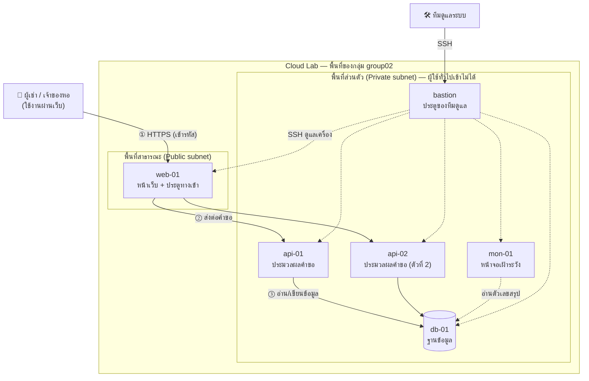

# DormDesk — System Architecture

> เอกสารนี้อธิบายว่าระบบ DormDesk วางอยู่บน cloud อย่างไร และปลอดภัยอย่างไร เขียนสำหรับคนที่ยังไม่เคยเห็นระบบมาก่อน อ่านตามลำดับได้เลย คำศัพท์เทคนิคมีคำอธิบายในหัวข้อ 3 · หัวข้อ 1–11 คือภาพรวม · หัวข้อ 12 คือรายละเอียดทางเทคนิค · หัวข้อ 13 คือวิธีตั้งค่าทุกเครื่อง (ใช้สร้างใหม่ถ้า Cloud Lab ถูก reset) · หัวข้อ 14 คือแผนทดสอบและหลักฐานที่ใช้ตอน Demo
>
> **เอกสารนี้คือแหล่งข้อมูลหลักด้านสถาปัตยกรรม** — `DormDesk_HANDOFF.md` และ `PROJECT_TRACKER.md` อ้างอิงตัวเลข IP พอร์ต และกฎ firewall จากที่นี่ ถ้าเปลี่ยนอะไร ให้แก้ที่นี่ก่อน

## 1. DormDesk คืออะไร

DormDesk คือเว็บสำหรับแจ้งซ่อมในหอพัก ใช้ได้หลายหอพร้อมกันในระบบเดียว

- **ผู้เช่า** เปิดลิงก์ประจำห้องที่เจ้าของหอส่งให้ แจ้งปัญหา แนบรูป และติดตามสถานะได้ โดยไม่ต้องสมัครสมาชิก
- **เจ้าของหอ** เข้าสู่ระบบเพื่อดูคำขอทั้งหมดของหอตัวเอง เปลี่ยนสถานะงาน และดูสรุปภาพรวม

สิ่งที่สำคัญที่สุดของระบบคือ **ข้อมูลของแต่ละหอต้องไม่ปนกัน** และ **คนนอกต้องเข้าถึงข้อมูลไม่ได้**

## 2. ภาพรวมระบบในหน้าเดียว



อ่านรูปนี้อย่างไร

- ระบบแบ่งเป็น 2 พื้นที่: **พื้นที่สาธารณะ** ที่คนภายนอกเข้าถึงได้ และ **พื้นที่ส่วนตัว** ที่คนภายนอกเข้าไม่ได้เลย
- ผู้ใช้เข้าได้ทางเดียวคือ **web-01** แล้ว web-01 ส่งคำขอต่อเข้าไปในพื้นที่ส่วนตัว
- ข้อมูลสำคัญทั้งหมดอยู่ใน **db-01** ซึ่งอยู่ลึกที่สุด และคุยได้เฉพาะกับเครื่องประมวลผล (api-01, api-02)
- ทีมดูแลระบบเข้าเครื่องต่างๆ ผ่าน **bastion** เท่านั้น
- **ข้อยกเว้นเดียวของพื้นที่ส่วนตัว** คือ bastion ที่แล็บเปิดพอร์ต 22002 ไว้ให้ ใช้ได้เฉพาะ SSH ต้องมีรหัสของกลุ่ม และเป็นทางเข้าของทีมดูแลเท่านั้น ไม่ใช่ทางเข้าของผู้ใช้ (บน cloud จริงเทียบได้กับ bastion host หรือ AWS SSM Session Manager)

## 3. คำศัพท์ที่ควรรู้

| คำศัพท์ | ความหมายแบบง่าย |
|---|---|
| Cloud Lab | ระบบ cloud จำลองของวิชา อาจารย์ใช้ server หนึ่งเครื่อง (45.77.40.35) แบ่งพื้นที่ให้แต่ละกลุ่มสร้างเครื่องของตัวเอง คล้าย AWS แบบย่อส่วน |
| Instance | "เครื่อง" หนึ่งเครื่องในระบบ (ใน Cloud Lab คือ container ที่ทำงานเหมือนคอมพิวเตอร์แยกกัน) |
| VPC | เครือข่ายส่วนตัวของกลุ่มเรา เครื่องของกลุ่มอื่นมองไม่เห็น |
| Subnet | ห้องย่อยในเครือข่าย · **Public** = คนนอกเข้าถึงได้ถ้าเปิดทางไว้ · **Private** = คนนอกเข้าไม่ได้เลย |
| IP | ที่อยู่ของเครื่องในเครือข่าย เช่น 10.0.2.10 |
| Port | ช่องทางเข้าของโปรแกรมในเครื่อง เช่น เว็บใช้ 443, ฐานข้อมูลใช้ 5432 |
| Port mapping | การเปิดช่องจากภายนอกให้ตรงเข้าเครื่องใดเครื่องหนึ่ง เช่น 45.77.40.35:10201 → web-01 |
| Firewall | กฎว่าใครต่อเข้า (และต่อออก) เครื่องนี้ได้บ้าง |
| Bastion | เครื่องประตูที่ทีมต้องผ่านก่อนเข้าไปดูแลเครื่องอื่น |
| HTTPS / TLS | การเข้ารหัสข้อมูลระหว่างเบราว์เซอร์กับเว็บ คนกลางทางอ่านไม่ได้ |
| API | โปรแกรมที่รับคำขอจากหน้าเว็บ ตรวจสิทธิ์ แล้วไปอ่าน/เขียนฐานข้อมูล |
| Load balancer | ตัวกระจายงานไปยังเครื่องหลายเครื่อง ถ้าเครื่องหนึ่งล่มก็ส่งไปอีกเครื่อง |
| Tenant | ลูกค้าหนึ่งราย ในที่นี้คือ **หอพักหนึ่งหอ** |

## 4. ส่วนประกอบของระบบ

| เครื่อง | อยู่ที่ | ทำหน้าที่อะไร | ทำไมต้องมี |
|---|---|---|---|
| **web-01** | พื้นที่สาธารณะ | แสดงหน้าเว็บ เข้ารหัส HTTPS และส่งคำขอต่อให้ API | เป็นประตูเดียวที่คนภายนอกเข้าได้ ทำให้คุมความปลอดภัยได้ที่จุดเดียว |
| **api-01** | พื้นที่ส่วนตัว | ประมวลผลคำขอ ตรวจว่าใครมีสิทธิ์ทำอะไร | ตรรกะของระบบไม่ควรอยู่ในเครื่องที่คนนอกเข้าถึงได้ |
| **api-02** | พื้นที่ส่วนตัว | ทำงานเหมือน api-01 | ถ้า api-01 ล่ม ระบบยังใช้งานได้ |
| **db-01** | พื้นที่ส่วนตัว | เก็บข้อมูลทั้งหมด (หอ ห้อง คำขอ รูป) | ข้อมูลอยู่ลึกที่สุด คุยได้เฉพาะกับ API |
| **mon-01** | พื้นที่ส่วนตัว | หน้าจอ Grafana แสดงเหตุการณ์ด้านความปลอดภัย | ให้ทีมเห็นว่ามีคนพยายามโจมตีหรือใช้งานผิดปกติหรือไม่ |
| **bastion** | พื้นที่ส่วนตัว | ประตู SSH ของทีมดูแล (Cloud Lab สร้างไว้ให้) | ไม่ต้องเปิด SSH ของทุกเครื่องให้คนนอก |

**ลำดับการลงมือ:** web-01 → api-01 → db-01 ต้องทำงานครบเส้นทางก่อน (ฟีเจอร์ Must) · api-02 และ mon-01 สร้างเครื่องไว้แล้ว แต่ติดตั้งซอฟต์แวร์หลังเส้นทางหลักผ่านการทดสอบในหัวข้อ 14

## 5. ข้อมูลเดินทางอย่างไร

ตัวอย่าง: ผู้เช่าห้อง 305 แจ้งว่าแอร์เสีย

1. ผู้เช่าเปิดลิงก์ประจำห้อง ซึ่งพาไปที่ `https://45.77.40.35:10201` ข้อมูลที่ส่งถูกเข้ารหัสด้วย HTTPS
2. คำขอเข้ามาที่ **web-01** ซึ่งเป็นทางเข้าเดียวของระบบ
3. web-01 ส่งคำขอต่อไปที่ **api-01 หรือ api-02** (ตัวไหนว่างก็ได้)
4. API ดูจากลิงก์ว่าเป็นหอไหน ห้องไหน ตรวจว่าไม่ได้ส่งถี่ผิดปกติ แล้วบันทึกลง **db-01**
5. ผู้เช่าได้ลิงก์ติดตามสถานะกลับไป
6. เจ้าของหอเข้าสู่ระบบ เห็นคำขอนี้เฉพาะในหอของตัวเอง แล้วเปลี่ยนสถานะเป็น "กำลังดำเนินการ"

ตลอดเส้นทางนี้ **คนภายนอกไม่เคยคุยกับ API หรือฐานข้อมูลโดยตรง**

## 6. ระบบปลอดภัยอย่างไร

ระบบใช้หลัก **ป้องกันหลายชั้น** ถ้าชั้นหนึ่งพลาด ยังมีชั้นถัดไปกันไว้

| # | หลักการ | ทำอย่างไร |
|---|---|---|
| 1 | ประตูเข้าบานเดียว | จาก internet เข้าได้เฉพาะพอร์ต 10201 ที่ไปยัง web-01 เครื่องอื่นไม่มีทางเข้าจากภายนอก |
| 2 | แต่ละเครื่องคุยได้เฉพาะเครื่องที่จำเป็น | firewall กำหนดว่า web-01 คุยกับ API ได้ · API คุยกับฐานข้อมูลได้ · นอกนั้นปฏิเสธทั้งหมด |
| 3 | จำกัดขาออกด้วย | ถ้ามีคนยึดเครื่องได้ ก็ส่งข้อมูลออกไปข้างนอกไม่ได้ |
| 4 | ข้อมูลแต่ละหอไม่ปนกัน | กันไว้ 3 ชั้น: ลิงก์ห้องเป็นรหัสสุ่มเดาไม่ได้ · API ใช้หอจากบัญชีที่ login เท่านั้น · ฐานข้อมูลเองก็บังคับให้เห็นเฉพาะข้อมูลของหอนั้น (Row-Level Security) |
| 5 | เข้ารหัสข้อมูล | ใช้ HTTPS ระหว่างผู้ใช้กับเว็บ และเข้ารหัสการเชื่อมต่อระหว่าง API กับฐานข้อมูล · รหัสผ่านเก็บแบบ hash |
| 6 | ให้สิทธิ์เท่าที่จำเป็น | บัญชีฐานข้อมูลของ API ลบตารางไม่ได้ · บัญชีของ Grafana อ่านได้แค่ตัวเลขสรุป |
| 7 | ทีมเข้าผ่านประตูเดียว | SSH ได้เฉพาะผ่าน bastion |
| 8 | มองเห็นการโจมตี | บันทึก login ผิด, การส่งถี่ผิดปกติ, การพยายามดูข้อมูลหออื่น แล้วแสดงใน Grafana |
| 9 | กู้คืนได้ | สำรองฐานข้อมูลด้วย pg_dump และทดสอบการกู้คืน |
| 10 | ไม่พึ่งชั้นเดียว | แม้ firewall ของแล็บยังไม่ทำงาน แต่ละโปรแกรมก็จำกัดเองด้วย: PostgreSQL รับเฉพาะ IP ของ API/mon-01 (`pg_hba.conf`) · Grafana ไม่มีพอร์ตสาธารณะ · API ต้องผ่านการตรวจสิทธิ์ทุกคำขอ |

> ✅ ข้อ 2 และ 3 บังคับใช้แล้ว (27 ก.ย. 2026) ด้วย iptables ในแต่ละเครื่อง (`infra/firewall/rules.sh`) — Console ของแล็บใช้ไม่ได้เพราะบั๊กชื่อเครื่อง เราจึงตั้งกฎชุดเดียวกันเอง · ผลตรวจ `tools/verify.sh` 20/20 อยู่ใน `evidence/`

## 7. ถ้าเกิดเหตุการณ์ต่อไปนี้ ระบบรับมืออย่างไร

| เหตุการณ์ | ผลที่เกิดขึ้น |
|---|---|
| api-01 ล่ม | web-01 ส่งงานไป api-02 แทนอัตโนมัติ ผู้ใช้ไม่รู้สึก |
| แฮกเกอร์ยึด web-01 ได้ | คุยได้แค่ API ซึ่งต้องผ่านการตรวจสิทธิ์ · ต่อฐานข้อมูลตรงๆ ไม่ได้ · ส่งข้อมูลออกนอกระบบไม่ได้ |
| มีคนสุ่มลิงก์ห้องเพื่อดูข้อมูลห้องอื่น | ลิงก์เป็นรหัสสุ่มยาว เดาไม่ได้ และถ้าลองผิดบ่อยจะถูกจำกัดและบันทึกไว้ |
| โค้ด API มีบั๊ก ลืมกรองหอ | ฐานข้อมูลยังบังคับให้เห็นเฉพาะหอของผู้ใช้ ข้อมูลไม่รั่ว |
| มีคนยิงคำขอปลอมจำนวนมาก | ถูกจำกัดจำนวนคำขอ (rate limit) ทั้งที่ web-01 และ API |
| ลิงก์ห้องหลุดไปถึงคนอื่น | เจ้าของหอเปลี่ยนรหัสห้องได้ทันที ลิงก์เก่าใช้ไม่ได้ |
| ข้อมูลเสียหาย | กู้คืนจากไฟล์สำรองได้ |
| web-01 หรือ db-01 ล่ม | ระบบหยุดชั่วคราว — เป็น **จุดเสี่ยงจุดเดียว (single point of failure)** ที่ยอมรับใน MVP กู้โดยสร้างใหม่ตามหัวข้อ 13 และ pg_restore (บน cloud จริงแก้ด้วย load balancer หลายโซน + ฐานข้อมูลแบบมีเครื่องสำรอง) |
| แล็บถูก reset ทั้งหมด | สร้างใหม่ตามหัวข้อ 13 จากโค้ดใน git + ไฟล์สำรองที่เก็บนอกแล็บ |

**ทำไม API มี 2 เครื่อง แต่ฐานข้อมูลมีเครื่องเดียว** — API ไม่เก็บข้อมูลในเครื่อง จึงเพิ่มเครื่องได้ง่ายและถูก ส่วนการทำฐานข้อมูลสำรองแบบ replication ต้องใช้ทรัพยากรและการดูแลเกินกรอบ 3 สัปดาห์ เราจึงเลือกป้องกันข้อมูลด้วยการสำรองและทดสอบกู้คืนแทน

## 8. ตอบโจทย์ของวิชาอย่างไร

| ข้อกำหนดของวิชา | DormDesk |
|---|---|
| ต้องมี public subnet และ private subnet | web-01 อยู่ public · API, ฐานข้อมูล และเครื่องอื่นอยู่ private |
| หน้าเว็บอยู่ใน public subnet | web-01 |
| REST API อยู่ใน private subnet | api-01, api-02 |
| เปิดพอร์ตสู่ internet เท่าที่จำเป็น | ระบบของเราเปิดพอร์ตเดียว (10201 → HTTPS) · ไม่เปิด HTTP · SSH ใช้ประตูของแล็บ (22002 → bastion) ซึ่งเป็นทางเข้าของทีมดูแล ไม่ใช่ของผู้ใช้ |

## 9. เลือกใช้อะไร และทำไม

| ส่วน | ใช้อะไร | เหตุผลแบบสั้น |
|---|---|---|
| Cloud | Cloud Lab ของวิชา | เป็นแพลตฟอร์มที่ใช้ประเมิน และให้เราควบคุมเครือข่ายกับ firewall เอง |
| หน้าเว็บ + ประตูทางเข้า | Nginx | เบา ทำได้หลายอย่างในตัวเดียว (หน้าเว็บ, HTTPS, ส่งต่อคำขอ, กระจายงาน, จำกัดคำขอ) |
| เครื่อง API | Ubuntu 24.04 | ได้อัปเดตความปลอดภัยระยะยาว ติดตั้งโปรแกรมง่าย มีคู่มือเยอะ |
| ภาษา / framework ของ API | Python + FastAPI | ตรวจรูปแบบข้อมูลขาเข้าให้อัตโนมัติ ลดช่องโหว่ และเขียนเร็ว |
| ฐานข้อมูล | PostgreSQL | ข้อมูลมีความสัมพันธ์ชัดเจน และมี Row-Level Security สำหรับแยกข้อมูลแต่ละหอ |
| หน้าจอเฝ้าระวัง | Grafana | มีในแล็บ ต่อฐานข้อมูลได้ทันที ไม่ต้องเขียนหน้าจอเอง |
| HTTPS | ใบรับรองจาก mkcert | ไม่มีโดเมนจึงขอใบรับรองสาธารณะไม่ได้ mkcert ออกใบรับรองให้ IP ได้ |
| รหัสผ่านผู้ใช้ | bcrypt | เก็บแบบ hash ถ้าฐานข้อมูลหลุดก็ถอดรหัสผ่านกลับได้ยาก |
| สำรองข้อมูล | pg_dump | มาพร้อม PostgreSQL ใช้ง่าย |

สิ่งที่ **ไม่ใช้**: เปิดพอร์ตให้ API หรือฐานข้อมูลโดยตรง (ผิดโจทย์และอันตราย) · HTTP ธรรมดา (ไม่เข้ารหัส) · CORS (ไม่จำเป็นเพราะหน้าเว็บกับ API ใช้ทางเข้าเดียวกัน)

## 10. สถานะปัจจุบันบน Cloud Lab

ตรวจเมื่อ 27 ก.ย. 2026

**เครื่องที่สร้างแล้ว (ทำงานอยู่ทั้งหมด)**

| เครื่อง | ซอฟต์แวร์ | IP | พื้นที่ | CPU / RAM |
|---|---|---|---|---|
| web-01 | Nginx 1.31 | 10.0.2.10 | public | 0.25 / 128 MB |
| api-01 | Ubuntu 24.04 | 10.0.2.140 | private | 0.5 / 512 MB |
| api-02 | Ubuntu 24.04 | 10.0.2.141 | private | 0.5 / 256 MB |
| db-01 | PostgreSQL 16.14 | 10.0.2.150 | private | 0.5 / 512 MB |
| mon-01 | Grafana | 10.0.2.165 | private | 0.25 / 256 MB |
| bastion | (แล็บสร้างให้) | 10.0.2.131 | private | – |

**ผลการตรวจ**

| เรื่อง | ผล |
|---|---|
| เปิดทางเข้า 10201 → web-01 (HTTPS) | ✅ ใช้งานได้ · TLS ผ่านการตรวจด้วย local CA ของทีม · HTTP ธรรมดาถูกปฏิเสธ |
| Nginx เห็น IP จริงของผู้ใช้ | ✅ access log แสดง IP สาธารณะของผู้ใช้ → rate limit ต่อ IP ใช้ได้ |
| public subnet ↔ private subnet | ❌ server แล็บทิ้งทุกแพ็กเก็ตข้าม subnet (แม้ route ผ่าน bastion) → ใช้ SSH tunnel ผ่าน bastion แทน (หัวข้อ 12.12) |
| Console Firewall | ❌ Console เติมชื่อกลุ่มซ้ำ (`group02-group02-api-01`) จึงหาเครื่องไม่เจอ — บั๊กของแล็บ → ตั้ง iptables เองแทน |
| เครื่องใน private subnet ไม่มีทางเข้าจากภายนอก | ✅ |
| พอร์ตที่ไม่ได้เปิด เข้าจากภายนอกไม่ได้ | ✅ |
| หน้า Firewall ตั้งกฎแบบช่วง IP และกฎขาออกได้ | ✅ |
| กฎ Firewall มีผลกับเครื่องจริง | ✅ ทุกเครื่อง INPUT/OUTPUT = DROP + เปิดเฉพาะตามภาคผนวก B (ติดตั้ง iptables เอง · เครื่องมีสิทธิ์ NET_ADMIN) · กฎหายเมื่อเครื่อง restart → รัน `infra/after_restart.sh` |
| รหัสผ่านเริ่มต้นของ PostgreSQL | ✅ เปลี่ยนแล้ว (เก็บใน `secrets.env`) |
| รหัสผ่านเริ่มต้นของ Grafana | ✅ เปลี่ยนแล้ว · data source `dormdesk_ro` แบบ TLS · dashboard "DormDesk — Security & Operations" |
| ระบบต้นแบบ (web-01 → api-01/02 → db-01) | ✅ ทำงานครบเส้นทาง · smoke test 16/16 · verify 20/20 · failover (ปิด api-01) 16/16 · backup+restore ตรงกันทุกตาราง (27 ก.ย. 2026) |

**แผนรับมือเรื่อง Firewall (ข้อกำหนดบังคับข้อ 4)** — ✅ ปิดแล้ว: ข้อ 2 ทำแล้ว และข้อ 3 ทำด้วย iptables เองโดยไม่ต้องรอ Console (ยังควรแจ้งอาจารย์เรื่องบั๊กตามข้อ 1)

| ลำดับ | ทำอะไร |
|---|---|
| 1 | แจ้งอาจารย์ทันที พร้อมหลักฐาน (ภาพหน้าจอ error ของ Console + ผล `which iptables` ในแต่ละเครื่อง) และถามว่า image ใดรองรับ firewall ของแล็บ |
| 2 | ระหว่างรอ ตั้ง **ชั้นป้องกันในตัวโปรแกรม**: `pg_hba.conf` รับเฉพาะ 10.0.2.136/29 และ 10.0.2.165 แบบ `hostssl` · Grafana ไม่มี port mapping · API ฟังเฉพาะ IP ภายใน |
| 3 | ถ้าแก้ได้ ตั้งกฎตามภาคผนวก B แล้วเก็บผล `iptables -L -n -v` ของทุกเครื่องเป็นหลักฐาน |
| 4 | ถ้าแก้ไม่ได้ทันเวลา ให้บอกตรงๆ ใน pitch ว่าออกแบบกฎไว้ครบ (ภาคผนวก B) แต่แพลตฟอร์มยังบังคับใช้ไม่ได้ และแสดงชั้นป้องกันข้อ 2 + ผลทดสอบหัวข้อ 14 แทน — ความซื่อตรงเรื่องนี้ได้คะแนนมากกว่าการอ้างว่าทำงาน |

**สิ่งที่ต้องทำต่อ (เรียงตามความสำคัญ)**
1. แผนรับมือ Firewall ด้านบน
2. เปลี่ยนรหัสผ่านเริ่มต้นของ PostgreSQL และ Grafana
3. ตั้ง HTTPS และการส่งต่อคำขอบน web-01 → ทดสอบ `/api/health` ทะลุจากภายนอกถึง api-01
4. ตั้งบัญชีฐานข้อมูลแยกสิทธิ์ และเปิด Row-Level Security บน db-01 (ภาคผนวก C)
5. ติดตั้ง API บน api-01 ให้ฟีเจอร์ Must ใช้งานได้ครบ
6. ตรวจว่า Nginx เห็น IP จริงของผู้ใช้หรือไม่ (หัวข้อ 12.8)
7. เมื่อข้อ 1–6 ผ่าน: ติดตั้ง API บน api-02 และตั้ง Grafana บน mon-01
8. รันแผนทดสอบหัวข้อ 14 และเก็บหลักฐาน

## 11. ข้อจำกัดของ Cloud Lab

| ใน Cloud Lab | บน cloud จริง (เช่น AWS) จะทำแบบนี้ |
|---|---|
| ไม่มีโดเมน ใช้ใบรับรอง HTTPS ที่สร้างเอง (เครื่องที่ไม่ได้ติดตั้งจะเห็นคำเตือน) | ใช้ใบรับรองสาธารณะที่ Load Balancer |
| Firewall ต้องพึ่งโปรแกรมในแต่ละเครื่อง | Security Group ทำงานนอกเครื่อง ไม่ขึ้นกับ OS |
| กฎ Firewall อ้างอิงเป็น IP | อ้างอิงเป็นกลุ่มเครื่อง (Security Group) |
| ฐานข้อมูลมีเครื่องเดียว | ใช้บริการฐานข้อมูลที่มีเครื่องสำรองและ backup อัตโนมัติ |
| รูปเก็บในฐานข้อมูล | เก็บใน object storage (เช่น S3) |
| Port mapping ของแล็บอาจทำให้เห็น IP ผู้ใช้เป็น IP ของ server แล็บ | Load Balancer ส่ง IP จริงมาใน `X-Forwarded-For` เสมอ |
| web-01 เครื่องเดียว | Load Balancer ที่กระจายหลาย Availability Zone |
| Bastion ที่เปิดพอร์ต SSH | AWS SSM Session Manager (ไม่ต้องเปิดพอร์ตเลย) |
| public ↔ private subnet ต่อกันไม่ได้ ต้องใช้ SSH tunnel ผ่าน bastion | Route table ใน VPC เดียวกันต่อกันได้เอง + Security Group กำหนดว่าใครคุยกับใครได้ |

## 12. รายละเอียดทางเทคนิค

หัวข้อนี้ขยายความจากภาพรวมด้านบน ว่าแต่ละส่วนทำงานจริงอย่างไร

### 12.1 Network ทำงานอย่างไร

- **VPC ของกลุ่ม** คือช่วง IP `10.0.2.0/24` (256 ที่อยู่) แบ่งครึ่งเป็น 2 subnet ขนาด `/25` (subnet ละ 128 ที่อยู่)

| Subnet | ช่วง IP | Gateway | ความหมาย |
|---|---|---|---|
| group02-public | 10.0.2.0 – 10.0.2.127 | 10.0.2.1 | เปิดทางจากภายนอกได้ด้วย port mapping |
| group02-private | 10.0.2.128 – 10.0.2.255 | 10.0.2.129 | ไม่มีทางเข้าจากภายนอก |

- **ทุกเครื่องเป็น Docker container** ที่รันบน server ของ Cloud Lab (45.77.40.35) และต่อเข้ากับ network ของ subnet ที่เลือกตอนสร้าง เครื่องต่าง subnet คุยกันผ่าน gateway
- **Port mapping** คือ server ของแล็บรับการเชื่อมต่อที่พอร์ตหนึ่ง แล้วส่งต่อเข้าเครื่องในวง (NAT) เช่น `45.77.40.35:10201` → `web-01:443` · พอร์ตที่ไม่ได้ map ไว้จะไม่มีทางเข้าเลย · กลุ่มเราใช้ได้ช่วง 10200–10299
- **ขาออกไป internet** ทั้งสอง subnet ออกได้ผ่าน server ของแล็บ ระบบของเราจึงต้องจำกัดขาออกด้วยกฎ firewall เอง
- **Bastion** เข้าจากภายนอกผ่าน `45.77.40.35:22002` → `bastion:22` แล้ว SSH ต่อไปยังเครื่องอื่นด้วย IP ภายใน — เป็นพอร์ตเดียวที่เข้าถึง private subnet จากภายนอกได้ และแล็บเป็นผู้เปิด ไม่ใช่ระบบของเรา

### 12.2 คำขอหนึ่งครั้งผ่านอะไรบ้าง

| ขั้น | เกิดที่ | รายละเอียด |
|---|---|---|
| 1 | Browser → server แล็บ | เปิด TCP ไปที่ `45.77.40.35:10201` แล็บส่งต่อไปที่ `web-01:443` |
| 2 | web-01 (Nginx) | ทำ TLS handshake (TLS 1.2/1.3) ด้วยใบรับรองของ IP `45.77.40.35` แล้วถอดรหัสคำขอ |
| 3 | web-01 (Nginx) | ตรวจเบื้องต้น: method ที่อนุญาต · ขนาดข้อมูลไม่เกิน 5 MB · จำนวนคำขอต่อ IP · ถ้าเป็นไฟล์หน้าเว็บก็ส่งกลับเลย ถ้าเป็น `/api/*` ส่งต่อ |
| 4 | web-01 → api | ส่งต่อผ่าน SSH tunnel (`127.0.0.1:8001` → api-01:8000, `127.0.0.1:8002` → api-02:8000 ผ่าน bastion) แบบ round-robin พร้อมแนบ IP จริงของผู้ใช้ใน `X-Real-IP` · ดูหัวข้อ 12.12 |
| 5 | api (FastAPI) | ตรวจรูปแบบข้อมูลขาเข้า (Pydantic) · ระบุตัวตน: ผู้เช่าจากรหัสห้องในลิงก์ · เจ้าของหอจาก session cookie · ตรวจสิทธิ์ต่อหอ |
| 6 | api → db-01 | เปิด transaction ไปที่ `db-01:5432` แบบเข้ารหัส (TLS) ด้วยบัญชี `dormdesk_app` · ตั้ง `app.dorm_id` เป็นหอของผู้ใช้ด้วย `SET LOCAL` (มีผลเฉพาะ transaction นี้ ไม่ค้างไปถึงคำขอถัดไปที่ใช้ connection เดียวกัน) · รัน SQL แบบ parameterized · Row-Level Security กรองให้เหลือเฉพาะข้อมูลหอนั้น |
| 7 | ย้อนกลับ | API ตอบเป็น JSON → Nginx เข้ารหัสกลับ → Browser · ถ้ามีเหตุผิดปกติ API บันทึกลง `security_events` |

### 12.3 ข้อมูลที่เก็บในฐานข้อมูล

ทุกตารางที่เป็นข้อมูลของลูกค้ามีคอลัมน์ `dorm_id` เพื่อบอกว่าเป็นของหอไหน

| ตาราง | เก็บอะไร |
|---|---|
| dorms | หอพัก |
| admins · admin_dorms | บัญชีเจ้าของหอ (รหัสผ่านแบบ hash) และหอที่แต่ละบัญชีดูแล |
| rooms | ห้อง + รหัสประจำห้อง (สุ่ม) |
| categories · dorm_categories | หมวดปัญหา และหมวดที่แต่ละหอเปิดใช้ |
| requests | คำขอแจ้งซ่อม: หมวด รายละเอียด ผู้แจ้ง สถานะ ความเร่งด่วน รหัสติดตาม (สุ่ม) |
| request_photos | รูปที่แนบ (เก็บเป็นข้อมูลในฐานข้อมูล) |
| request_events | ประวัติการเปลี่ยนสถานะทุกครั้ง (audit trail) |
| security_events | เหตุการณ์ด้านความปลอดภัย สำหรับ Grafana |

### 12.4 REST API

endpoint หลักด้านล่าง · รายการเต็ม (รวม logout, ดูรูป, จัดการห้อง, ตั้งค่าหมวด) อยู่ใน `DormDesk_HANDOFF.md` ข้อ 8

| Method | Path | ใครใช้ | ทำอะไร |
|---|---|---|---|
| GET | /api/health | – | ตรวจว่า API ทำงาน |
| GET | /api/rooms/{roomCode} | ผู้เช่า | ข้อมูลหอ/ห้อง และหมวดที่เปิด |
| POST | /api/rooms/{roomCode}/requests | ผู้เช่า | แจ้งปัญหา ได้รหัสติดตามกลับ |
| GET | /api/track/{token} | ผู้เช่า | ดูสถานะและประวัติ |
| POST | /api/auth/login | เจ้าของหอ | เข้าสู่ระบบ |
| GET | /api/admin/dorms | เจ้าของหอ | หอที่ตัวเองดูแล |
| GET | /api/admin/dorms/{id}/requests | เจ้าของหอ | รายการคำขอ กรองตามสถานะ/หมวด |
| PATCH | /api/admin/requests/{id} | เจ้าของหอ | เปลี่ยนสถานะ / ความเร่งด่วน |
| GET | /api/admin/dorms/{id}/dashboard | เจ้าของหอ | ตัวเลขสรุป |
| POST | /api/admin/rooms/{id}/rotate-code | เจ้าของหอ | ออกรหัสห้องใหม่ |

### 12.5 การยืนยันตัวตนและการแยกข้อมูลแต่ละหอ

- **ผู้เช่า (ไม่มีบัญชี):** ลิงก์ห้องมีรหัสสุ่มยาว 128 bit · API เรียกฟังก์ชัน `resolve_room(code)` ในฐานข้อมูลเพื่อหาว่าเป็นหอ/ห้องไหน แล้วใช้หอนั้นตลอดคำขอ · ผู้เช่าเลือกหอเองไม่ได้
- **เจ้าของหอ:** login ด้วยอีเมล + รหัสผ่าน (ตรวจกับ hash แบบ bcrypt) → ได้ session token ที่ลงลายเซ็นไว้ เก็บใน cookie แบบ `HttpOnly; Secure; SameSite=Strict` (JavaScript อ่านไม่ได้ ส่งข้ามเว็บไม่ได้) · ทุกคำขอ API ตรวจว่าบัญชีนี้ดูแลหอที่ขอจริง
- **Row-Level Security:** ฐานข้อมูลกรองทุกคำสั่งด้วยค่า `app.dorm_id` ที่ API ตั้งไว้ ถ้าไม่ได้ตั้งจะได้ 0 แถว จึงปลอดภัยแม้โค้ดลืมกรอง
- **ข้อควรระวังที่ทำให้ RLS ไม่ทำงานโดยไม่รู้ตัว** (ตั้งตามภาคผนวก C):
  - เจ้าของตาราง (table owner) และ superuser ข้าม RLS ได้ → ตารางเป็นของ `postgres` ส่วน `dormdesk_app` ไม่ใช่เจ้าของ ไม่มีสิทธิ์ `BYPASSRLS` และทุกตารางตั้ง `FORCE ROW LEVEL SECURITY`
  - ก่อนรู้ว่าเป็นหอไหน (เปิดลิงก์ห้อง / ลิงก์ติดตาม) ใช้ฟังก์ชัน `resolve_room(code)` และ `resolve_tracking(token)` แบบ `SECURITY DEFINER` ที่คืนเฉพาะ `dorm_id`/`room_id` ของรหัสนั้น ไม่เปิดตารางให้อ่านทั้งหมด
  - เจ้าของที่ดูแลหลายหอ: ตั้ง `app.dorm_id` ทีละหอตามที่เลือก หลังตรวจกับ `admin_dorms` แล้ว

### 12.6 Firewall ทำงานอย่างไร

- ตั้งแยกทีละเครื่องในหน้า Firewall ของ Console ทั้ง **ขาเข้า (Ingress)** และ **ขาออก (Egress)**
- หลักการคือ **ปฏิเสธทุกอย่าง แล้วเปิดเฉพาะที่จำเป็น** (default deny)
- เป็นแบบ **stateful**: ถ้าอนุญาตให้การเชื่อมต่อเข้ามาแล้ว การตอบกลับจะผ่านได้เองโดยไม่ต้องตั้งกฎขาออกเพิ่ม
- ต้นทางกำหนดเป็นช่วง IP (CIDR) ได้ เช่น `10.0.2.136/29` หมายถึง 10.0.2.136–10.0.2.143 (โซน app)
- Console ใช้ iptables ภายในแต่ละเครื่องในการบังคับกฎ (รายการกฎทั้งหมดอยู่ในภาคผนวก B)

### 12.7 การเข้ารหัสและการเก็บความลับ

| ส่วน | วิธี |
|---|---|
| Browser ↔ web-01 | HTTPS · TLS 1.2/1.3 · ใบรับรองออกโดย local CA (mkcert) · ไม่เปิด HTTP |
| API ↔ db-01 | PostgreSQL TLS · pg_hba บังคับ `hostssl` |
| ใบรับรองในวัน Demo | ติดตั้ง local CA ของ mkcert บนเครื่องที่ใช้ demo ล่วงหน้า เพื่อไม่ให้มีหน้าคำเตือน · ถ้าอาจารย์เปิดจากเครื่องตัวเอง อธิบายก่อนว่าคำเตือนเกิดเพราะไม่มีโดเมน (หัวข้อ 11) ไม่ใช่เพราะไม่เข้ารหัส |
| รหัสผ่านเจ้าของหอ | bcrypt (hash แบบช้า ป้องกันการเดาย้อนกลับ) |
| รหัสฐานข้อมูล / session secret | อยู่ในไฟล์ `/srv/dormdesk/.env` บน api เท่านั้น (สิทธิ์ 600 ไม่เข้า git) |
| รหัสเข้าเครื่องทั้งหมด | เก็บแยกในไฟล์ `cloud_pass.txt` ของทีม ไม่อยู่ในเอกสารนี้ |

### 12.8 การป้องกันการใช้งานผิดปกติ

| กลไก | ค่าที่ตั้ง |
|---|---|
| จำกัดการแจ้งปัญหา (หลัก) | 5 เรื่อง / 10 นาที **ต่อห้อง** (API นับจากฐานข้อมูล) — ผูกกับรหัสห้อง จึงไม่กระทบห้องอื่นที่ใช้ Wi-Fi เดียวกัน |
| จำกัดการแจ้งปัญหา (ชั้นนอก) | 30 เรื่อง / 10 นาที ต่อ IP (Nginx) — ตั้งหลวมกว่า เพราะผู้เช่าทั้งหอมักออก internet ด้วย IP เดียวกัน |
| จำกัดการ login | 5 ครั้ง / นาที ต่อ IP |
| จำกัดคำขอ API ทั่วไป | 10 ครั้ง / วินาที ต่อ IP (ยอมให้เกินชั่วคราว 20) |
| ขนาดข้อมูลที่ส่งได้ | ไม่เกิน 5 MB |
| รูปที่อัปโหลด | รับเฉพาะ jpg / png / webp · แปลงไฟล์ใหม่เพื่อลบข้อมูลแฝง (EXIF เช่นพิกัด GPS) |
| Security headers | `X-Content-Type-Options`, `X-Frame-Options`, `Referrer-Policy: no-referrer` (กันรหัสห้อง/รหัสติดตามใน URL รั่วไปเว็บอื่น) · ซ่อนเวอร์ชันของ Nginx |
| Log | access log ของ Nginx ตัดรหัสห้องและรหัสติดตามออกจาก path ก่อนบันทึก |

**ต้องตรวจก่อนเชื่อค่า rate limit ต่อ IP:** port mapping ของแล็บอาจแปลง IP ต้นทาง (NAT) ทำให้ Nginx เห็นทุกคนเป็น IP ของ server แล็บ ทดสอบโดยเปิดเว็บจาก 2 เครือข่าย (Wi-Fi มหาวิทยาลัย และ hotspot มือถือ) แล้วดู `$remote_addr` ใน access log · ถ้าเห็นเป็น IP เดียวกัน ให้ปิด limit ต่อ IP และพึ่ง limit ต่อห้อง + ต่อบัญชี login แทน แล้วบันทึกเป็นข้อจำกัดในหัวข้อ 11

### 12.9 การทำงานต่อเมื่อเครื่องล่ม (High Availability)

- Nginx มีรายชื่อ API 2 เครื่อง ถ้าเครื่องใดตอบผิดพลาด 2 ครั้ง จะหยุดส่งงานไปเครื่องนั้น 10 วินาที แล้วลองใหม่
- คำขอที่ล้มเหลวระหว่างทางจะถูกส่งซ้ำไปอีกเครื่องทันที **รวมถึง POST/PATCH** (`proxy_next_upstream ... non_idempotent`) — ปลอดภัยเพราะ: หน้าเว็บส่ง `Idempotency-Key` (สุ่มใหม่ทุกครั้งที่กรอกฟอร์ม) ถ้าคีย์ซ้ำ API คืนคำขอเดิมแทนการสร้างใหม่ (unique index `requests(dorm_id, idem_key)`) · PATCH ตั้งค่าสถานะแบบค่าตายตัว ส่งซ้ำได้ผลเท่าเดิม
- ทำไมต้องส่งซ้ำ POST: เพราะ Nginx ต่อ API ผ่าน SSH tunnel — tunnel รับการเชื่อมต่อก่อนแล้วค่อยพบว่า API ล่ม Nginx จึงเห็นเป็น "ส่งไปแล้วแต่ขาด" ไม่ใช่ "ต่อไม่ติด" (ทดสอบจริง: ก่อนแก้ POST ได้ 502 ระหว่าง failover · หลังแก้ผ่านทั้งหมด — `evidence/A9_failover.txt`)
- ทำได้เพราะ API **ไม่เก็บสถานะไว้ในเครื่อง**: session อยู่ใน token ที่ผู้ใช้ถือ · รูปอยู่ในฐานข้อมูล · ตัวนับ rate limit ต่อห้องอ่านจากฐานข้อมูล
- **ขอบเขตที่ยอมรับ:** HA ครอบคลุมเฉพาะชั้น API · web-01 และ db-01 ยังเป็น single point of failure (เหตุผลในหัวข้อ 7) · session แบบ token ที่ลงลายเซ็นยกเลิกทีละเครื่องไม่ได้ จึงตั้งอายุสั้น (8 ชั่วโมง) และเปลี่ยน `SESSION_SECRET` ได้ถ้าต้องบังคับ logout ทุกคน
- **Demo:** ปิด api-01 ระหว่าง demo (`kill` process) แล้วแสดงว่าหน้าเว็บยังใช้งานได้ผ่าน api-02

### 12.10 การเฝ้าระวัง (Monitoring)

- API บันทึกลงตาราง `security_events` (เวลา, ประเภท, IP, หอ, รายละเอียด) เมื่อเกิด: login ผิด · ถูกจำกัดคำขอ · พยายามดูข้อมูลหออื่น · ใช้รหัสห้อง/รหัสติดตามที่ไม่ถูกต้อง
- Grafana บน mon-01 อ่านตัวเลขสรุปด้วยบัญชี `dormdesk_ro` แล้วแสดงเป็นกราฟ
- Grafana ไม่มีพอร์ตสาธารณะ ทีมเปิดดูผ่าน SSH tunnel: `ssh -J root@45.77.40.35:22002 -L 3000:10.0.2.165:3000 root@10.0.2.165` แล้วเปิด `http://localhost:3000`

### 12.11 การสำรองและกู้คืนข้อมูล

- สำรอง: `ssh -J root@45.77.40.35:22002 root@10.0.2.150 "pg_dump -U postgres -Fc dormdesk" > dormdesk_YYYYMMDD.dump`
- กู้คืน: คัดลอกไฟล์ไปที่ db-01 แล้วรัน `pg_restore -U postgres -d dormdesk --clean dormdesk_YYYYMMDD.dump`
- เก็บไฟล์สำรองไว้นอก Cloud Lab เสมอ

### 12.12 web-01 คุยกับ API อย่างไร (SSH tunnel ผ่าน bastion)

**ปัญหาที่พบ (27 ก.ย. 2026):** server ของแล็บแยก `group02-public` กับ `group02-private` เป็นคนละ Docker network และทิ้งแพ็กเก็ตข้าม subnet ทั้งหมด — web-01 ต่อ api-01 ไม่ได้ทุกพอร์ต แม้เพิ่ม route ให้วิ่งผ่าน bastion (ตัวนับ `ForwDatagrams` ของ bastion = 0) · เครื่องเดียวที่อยู่ทั้ง 2 subnet คือ bastion (10.0.2.3 / 10.0.2.131)

**ทางแก้:** web-01 เปิด SSH tunnel ค้างไว้ไปที่ bastion แล้ว forward ต่อไปยัง API

```
Nginx (web-01) ──► 127.0.0.1:8001 ══ SSH (เข้ารหัส) ══► bastion 10.0.2.3 ──► api-01 10.0.2.140:8000
               ──► 127.0.0.1:8002 ══════════════════►                  ──► api-02 10.0.2.141:8000
```

| จุด | การจำกัดสิทธิ์ |
|---|---|
| กุญแจ SSH ของ web-01 บน bastion | `from="10.0.2.10"` (ใช้ได้จาก web-01 เท่านั้น) · `restrict` + `command="/bin/false"` (ไม่ได้ shell) · `permitopen` เฉพาะ `10.0.2.140:8000` และ `10.0.2.141:8000` |
| ถ้า web-01 ถูกยึด | ใช้กุญแจนี้ได้แค่เปิดทางไป API พอร์ต 8000 — ไป db-01 หรือเครื่องอื่นไม่ได้ |
| API | ไม่มี port mapping · ยังอยู่ใน private subnet · ข้อกำหนดข้อ 3 ครบ |
| ทางเข้าจาก internet | ยังเป็นพอร์ตเดียว (10201) · ข้อกำหนดข้อ 4 ครบ |
| ผลพลอยได้ | ทราฟฟิก web → API ถูกเข้ารหัสด้วย SSH |
| การดูแล | สคริปต์ `infra/remote/tunnel.sh` วนต่อใหม่อัตโนมัติถ้าหลุด · หลัง web-01 restart ต้องรัน `sh /usr/local/bin/dd-tunnel.sh start` (หรือ `infra/deploy.sh web`) |

บน cloud จริงไม่ต้องทำแบบนี้ เพราะ subnet ใน VPC เดียวกันต่อกันได้ผ่าน route table และคุมสิทธิ์ด้วย Security Group — เป็นข้อจำกัดของแล็บที่ควรเล่าใน pitch (หัวข้อ 11)

## 13. การตั้งค่า Instances ทั้งหมด (ใช้สร้างใหม่ถ้า Cloud Lab ถูก reset)

### 13.1 สิ่งที่ต้องเก็บไว้นอก Cloud Lab

ถ้าแล็บถูก reset ทุกอย่างในเครื่องจะหายหมด ต้องมีสิ่งเหล่านี้เก็บไว้ที่อื่นเสมอ

| สิ่งที่ต้องเก็บ | เก็บที่ไหน |
|---|---|
| โค้ด API และหน้าเว็บ · config ของ Nginx · script ติดตั้ง · `verify.sh` | git repository ของทีม (โฟลเดอร์ `infra/` — **ยังไม่ได้สร้าง ต้องทำในสัปดาห์ Sprint 1**) |
| ใบรับรอง HTTPS (cert + key) และ local CA | เครื่องของผู้ดูแล infra (ห้ามเข้า git) |
| รหัสผ่านทุกตัว และไฟล์ `.env` | `cloud_pass.txt` ของทีม |
| ข้อมูลในฐานข้อมูล | ไฟล์ `pg_dump` ล่าสุด |
| Dashboard ของ Grafana | export เป็นไฟล์ JSON |

### 13.2 ค่าที่ใส่ในหน้า Create Instance

| ช่องในฟอร์ม | web-01 | api-01 | api-02 | db-01 | mon-01 |
|---|---|---|---|---|---|
| Image | Nginx | Ubuntu 24.04 | Ubuntu 24.04 | PostgreSQL | Grafana |
| Instance Name | web-01 | api-01 | api-02 | db-01 | mon-01 |
| Network | group02-public | group02-private | group02-private | group02-private | group02-private |
| Static IP | 10.0.2.10 | 10.0.2.140 | 10.0.2.141 | 10.0.2.150 | 10.0.2.165 |
| vCPU | 0.25 | 0.5 | 0.5 | 0.5 | 0.25 |
| RAM | 128 MB | 512 MB | 256 MB | 512 MB | 256 MB |
| Port Mappings | 10201 → 443 | – | – | – | – |
| Environment | – | – | – | POSTGRES_DB=dormdesk · POSTGRES_PASSWORD=(ดู cloud_pass.txt) | – |

หมายเหตุ: Console จะเติมชื่อกลุ่มหน้าชื่อเครื่องเอง (เช่น `group02-web-01`) และสร้างรหัส SSH ของ root ใหม่ทุกครั้ง — คัดลอกรหัสจากปุ่ม 📋 ในหน้า Instances ไปอัปเดต `cloud_pass.txt`

### 13.3 สิ่งที่ต้องตั้งเพิ่มในแต่ละเครื่องหลังสร้าง

| เครื่อง | ต้องทำ | ไฟล์ที่เกี่ยวข้อง |
|---|---|---|
| db-01 | สร้างบัญชี `dormdesk_app`, `dormdesk_ro` · สร้างตาราง · เปิด Row-Level Security · ตั้ง pg_hba ให้รับเฉพาะ app zone และ mon-01 แบบ `hostssl` · ใส่ใบรับรอง TLS · กู้ข้อมูลจาก dump (ถ้ามี) | `/var/lib/postgresql/data/pg_hba.conf`, `postgresql.conf` |
| api-01, api-02 | ติดตั้ง Python + FastAPI · ดึงโค้ดจาก git · สร้าง `.env` · รันด้วย `start.sh` (เครื่องไม่มี systemd ต้องรันใหม่หลัง restart) | `/srv/dormdesk/.env`, `/srv/dormdesk/start.sh` |
| web-01 | ใส่ใบรับรอง HTTPS · ใส่ config Nginx (listen 443, upstream api-01/02, rate limit, headers) · คัดลอกไฟล์หน้าเว็บ | `/etc/nginx/conf.d/default.conf`, `/etc/nginx/tls/`, `/usr/share/nginx/html/` |
| mon-01 | เปลี่ยนรหัส admin · เพิ่ม data source PostgreSQL (db-01, บัญชี `dormdesk_ro`) · import dashboard | หน้าเว็บ Grafana |
| ทุกเครื่อง | ตั้งกฎ Firewall ขาเข้าและขาออกตามภาคผนวก B | หน้า Firewall ของ Console |

**ติดตั้งก่อน ปิดขาออกทีหลัง:** api-01/api-02 ต้องออก internet เพื่อติดตั้ง package (apt, pip) ให้ติดตั้งให้เสร็จก่อนตั้งกฎขาออก หรือเปิดกฎขาออกชั่วคราว (TCP 80/443 + DNS 53) แล้วลบทันทีหลังติดตั้ง

### 13.4 ลำดับการสร้างใหม่

1. สร้าง **db-01** → ตั้งบัญชีและ pg_hba → กู้ข้อมูลจาก dump
2. สร้าง **api-01, api-02** → ติดตั้งและรัน API → ทดสอบ `curl http://10.0.2.140:8000/api/health` จาก bastion
3. สร้าง **web-01** → ตั้ง HTTPS และ reverse proxy → ทดสอบ `https://45.77.40.35:10201`
4. สร้าง **mon-01** → ตั้ง Grafana
5. ตั้ง **Firewall** ทุกเครื่อง (ใส่กฎ SSH จาก bastion ก่อนเสมอ)
6. รัน `verify.sh` ตรวจว่ากฎทั้งหมดทำงาน (**สคริปต์นี้ยังไม่ได้เขียน** — ทำตามรายการทดสอบในหัวข้อ 14)
7. อัปเดตรหัสใหม่ทั้งหมดใน `cloud_pass.txt`

### 13.5 รหัสผ่านและข้อมูลเข้าเครื่อง

รหัสจริงเก็บอยู่ใน `cloud_pass.txt` ของทีมเท่านั้น (เอกสารนี้ใช้แชร์และนำเสนอ จึงไม่ใส่รหัส) รายการที่มี:

| รายการ | ใช้ทำอะไร |
|---|---|
| รหัส group02 (Console / bastion) | เข้าหน้า Console และ SSH เข้า bastion |
| รหัส root ของ web-01, api-01, api-02, db-01, mon-01 | SSH เข้าแต่ละเครื่อง (ผ่าน bastion) |
| รหัส postgres ของ db-01 | ผู้ดูแลฐานข้อมูล |
| รหัส dormdesk_app, dormdesk_ro | บัญชีฐานข้อมูลของ API และ Grafana |
| รหัส admin ของ Grafana | เข้าหน้า dashboard |
| SESSION_SECRET | ใช้ลงลายเซ็น session ของ API |

## 14. แผนทดสอบและหลักฐานสำหรับ Demo

ทุกข้ออ้างด้านความปลอดภัยในสไลด์ต้องมีผลทดสอบรองรับ เก็บผลเป็นภาพหน้าจอ/ข้อความไว้ในโฟลเดอร์ `evidence/` และรวมเข้า `verify.sh`

### 14.1 Network (ข้อกำหนดบังคับ 1–4)

| # | ทดสอบ | ทำจากไหน | คำสั่งตัวอย่าง | ผลที่ต้องได้ |
|---|---|---|---|---|
| N1 | เว็บเข้าได้ทาง HTTPS | เครื่องตัวเอง | `curl -k https://45.77.40.35:10201/api/health` | `{"status":"ok"}` |
| N2 | พอร์ตอื่นในช่วงของกลุ่มปิด | เครื่องตัวเอง | `nc -zv -w3 45.77.40.35 10202` | ต่อไม่ได้ |
| N3 | API เข้าจากภายนอกไม่ได้ | เครื่องตัวเอง | ไม่มี port mapping → ไม่มีเส้นทาง | ไม่มีทางเข้า |
| N4 | web-01 → API ได้ | web-01 | `curl http://10.0.2.140:8000/api/health` | ok |
| N5 | web-01 → db-01 **ไม่ได้** | web-01 | `nc -zv -w3 10.0.2.150 5432` | ถูกปฏิเสธ (firewall หรือ pg_hba) |
| N6 | API → db-01 ได้ | api-01 | `psql "host=10.0.2.150 sslmode=require user=dormdesk_app"` | เชื่อมต่อได้ แบบ SSL |
| N7 | db-01 ออก internet **ไม่ได้** | db-01 | `curl -m5 https://example.com` | timeout (ต้องมี firewall ขาออก) |
| N8 | กฎ firewall มีผลจริง | ทุกเครื่อง | `iptables -L -n -v` | ตรงกับภาคผนวก B |

### 14.2 Application

| # | ทดสอบ | ผลที่ต้องได้ |
|---|---|---|
| A1 | เจ้าของหอ A เรียก `/api/admin/dorms/{id ของหอ B}/requests` | 403 และมีบันทึกใน `security_events` |
| A2 | เจ้าของหอ A แก้ `PATCH /api/admin/requests/{id ของหอ B}` | 404/403 และข้อมูลหอ B ไม่เปลี่ยน |
| A3 | รัน `SELECT * FROM requests` ด้วยบัญชี `dormdesk_app` โดยไม่ตั้ง `app.dorm_id` | 0 แถว (พิสูจน์ RLS) |
| A4 | เปิดรหัสห้อง/รหัสติดตามที่สุ่มขึ้นเอง | 404 และถูกนับเพื่อ rate limit |
| A5 | ยิงแจ้งปัญหา 10 ครั้งติดจากห้องเดียว | ครั้งที่ 6 ขึ้นไปได้ 429 |
| A6 | login ผิด 6 ครั้งใน 1 นาที | ถูกจำกัด 429 |
| A7 | อัปโหลดไฟล์ .exe เปลี่ยนนามสกุลเป็น .jpg / ไฟล์ 10 MB | ถูกปฏิเสธ |
| A8 | เปลี่ยนรหัสห้อง แล้วเปิดลิงก์เก่า | ใช้ไม่ได้ · คำขอเก่ายังอยู่ครบ |
| A9 | ปิด api-01 ระหว่างใช้งาน | เว็บยังใช้ได้ผ่าน api-02 |
| A10 | pg_dump → ลบฐานข้อมูลทดสอบ → pg_restore | ข้อมูลกลับมาครบ |

### 14.3 ลำดับ Live Demo 5 นาที (แนะนำ)

1. **ผู้เช่า (1 นาที)** — เปิดลิงก์ห้องบนมือถือ แจ้ง "แอร์ไม่เย็น" + รูป → ได้ลิงก์ติดตาม
2. **เจ้าของ (1.5 นาที)** — login → เห็นคำขอ → เปลี่ยนเป็น "กำลังดำเนินการ" → ผู้เช่ารีเฟรชเห็นสถานะใหม่ → เปิด dashboard
3. **พิสูจน์ความปลอดภัย (2 นาที)** — A1 ข้ามหอถูกปฏิเสธ · N2/N3 เข้าจากภายนอกไม่ได้ · A9 ปิด api-01 แล้วยังใช้ได้ · Grafana แสดงเหตุการณ์ที่เพิ่งเกิด
4. **สำรอง (0.5 นาที)** — ถ้าอะไรล่ม เปิดวิดีโอที่อัดไว้ทันที

## 15. ส่วนขยายล่าสุด (27 ก.ย. 2026)

| ส่วน | สิ่งที่เพิ่ม | ความปลอดภัย |
|---|---|---|
| **ai-01** (10.0.2.160, private, 1 vCPU / 1 GB) | llama.cpp server + Qwen3-0.6B (โมเดลฟรี, Apache-2.0) สำหรับ "ถาม AI" ของเจ้าของหอ | รับเฉพาะโซน app พอร์ต 8080 + API key · ไม่มีขาออก · ไม่มี port mapping |
| **AI Insight flow** | คำถาม → intent → SQL ที่เขียนไว้ล่วงหน้าใน `tenant_tx` (RLS) → ตัวเลขสรุป → คำตอบแบบ template → โมเดลช่วยเรียบเรียง | โมเดลไม่เห็นฐานข้อมูล/ข้อความผู้เช่า/ข้อมูลส่วนตัว · คำตอบของโมเดลถูกปฏิเสธถ้าตัวเลขไม่ตรงหรือผูกตัวเลขผิดหมวด/ห้อง → ใช้ template แทน · จำกัด 20 คำถาม/10 นาที/บัญชี |
| **อีเมลแจ้งเตือน** | ผู้เช่า: ยืนยันรับเรื่อง + ทุกครั้งที่สถานะเปลี่ยน · เจ้าของ: เรื่องใหม่ (Gmail SMTP + App Password) | ส่งแบบ background ไม่ถ่วงหน้าเว็บ · API เปิดขาออกเฉพาะ TCP 587 · รหัสอยู่ใน `.env` เท่านั้น · ส่งไม่สำเร็จบันทึก `email_failed` |
| **HTTPS ที่เบราว์เซอร์เชื่อถือ** | โดเมนฟรี `dormdesk-g02.duckdns.org` → 45.77.40.35 · ใบรับรอง Let's Encrypt ผ่าน DNS-01 (ไม่ต้องใช้พอร์ต 80/443) · เข้าด้วย IP จะถูก redirect ไปโดเมน · HSTS 7 วัน | ต่ออายุด้วย `infra/tls/renew-letsencrypt.sh` ทุก ~60 วัน |
| **Tunnel ผ่าน bastion (least privilege)** | ใช้บัญชี `ddtunnel` แทน root: ไม่มีรหัสผ่าน ไม่มี shell ใช้ได้จาก web-01 เท่านั้น และเปิดได้แค่ API:8000 | ทดสอบแล้ว: เปิด shell ไม่ได้ · forward ไป db-01 ถูกปฏิเสธ (`evidence/bastion_tunnel_least_privilege.txt`) |

**ทำไม bastion ยังอยู่ในเส้นทางของผู้ใช้:** แล็บทิ้งทราฟฟิกข้าม subnet และให้แต่ละเครื่องต่อได้ subnet เดียว bastion (ที่แล็บเรียกว่า VPC gateway) จึงเป็นทางเดียว เราจำกัดสิทธิ์ให้แคบที่สุดแล้ว วิธีแก้ถาวรคือให้แล็บเปิด route ระหว่าง subnet (บน AWS = route table + Security Group)

## ภาคผนวก A — ตาราง IP และโซน (สำหรับคนลงมือ)

เครือข่ายส่วนตัวถูกแบ่งเป็นโซนย่อยตามหน้าที่ เพื่อให้กฎ firewall อ้างอิงเป็นกลุ่มได้ เช่น "ทุกเครื่องในโซน app" (เพิ่มเครื่อง API ใหม่ในโซนเดิมได้โดยไม่ต้องแก้กฎของฐานข้อมูล)

| โซน | ช่วง IP | เครื่อง |
|---|---|---|
| web | 10.0.2.8/29 | web-01 (10.0.2.10) |
| mgmt | 10.0.2.128/29 | bastion (10.0.2.131) |
| app | 10.0.2.136/29 | api-01 (10.0.2.140), api-02 (10.0.2.141) |
| data | 10.0.2.144/28 | db-01 (10.0.2.150) |
| ops | 10.0.2.160/28 | ai-01 (10.0.2.160), mon-01 (10.0.2.165) |

ทางเข้าจากภายนอก: `45.77.40.35:10201` → web-01:443 (ผู้ใช้) · `45.77.40.35:22002` → bastion:22 (ทีมดูแล)

## ภาคผนวก B — กฎ Firewall

**ขาเข้า** (นอกจากนี้ปฏิเสธทั้งหมด)

| เครื่อง | เปิดพอร์ต | ให้ใครเข้าได้ |
|---|---|---|
| web-01 | 443 | ทุกคน |
| ai-01 | 8080 | โซน app (10.0.2.136/29) |
| api-01, api-02 | 8000 | bastion 10.0.2.131 (ปลายทาง SSH tunnel จาก web-01 — หัวข้อ 12.12) |
| db-01 | 5432 | โซน app (10.0.2.136/29) และ mon-01 (10.0.2.165) |
| mon-01 | 3000 | bastion (10.0.2.131) |
| web-01 | 22 | bastion ฝั่ง public (10.0.2.3) |
| api, db, mon | 22 (SSH) | bastion (10.0.2.131) |

**ขาออก** (นอกจากนี้ปฏิเสธทั้งหมด · การตอบกลับของการเชื่อมต่อที่มีอยู่แล้วผ่านได้เสมอ)

| เครื่อง | ออกไปได้ที่ |
|---|---|
| web-01 | bastion 10.0.2.3 พอร์ต 22 (SSH tunnel ไป API — หัวข้อ 12.12) |
| api-01, api-02 | db-01:5432 · ai-01:8080 · TCP 587 (Gmail SMTP) · ช่วงติดตั้ง package เปิดทั้งหมดชั่วคราว |
| ai-01 | ไม่อนุญาตการเชื่อมต่อใหม่ |
| db-01 | ไม่อนุญาตการเชื่อมต่อใหม่ |
| mon-01 | db-01 พอร์ต 5432 |

## ภาคผนวก C — ตัวอย่าง config

**Row-Level Security บน db-01** — ฐานข้อมูลคืนเฉพาะแถวของหอที่ตั้งไว้ ถ้าไม่ตั้งจะได้ 0 แถว
```sql
-- ตารางเป็นของ postgres · dormdesk_app ไม่ใช่เจ้าของ และไม่มี BYPASSRLS
CREATE ROLE dormdesk_app LOGIN NOBYPASSRLS PASSWORD '...';
GRANT SELECT, INSERT, UPDATE ON requests, rooms, request_photos, request_events TO dormdesk_app;

ALTER TABLE requests ENABLE ROW LEVEL SECURITY;
ALTER TABLE requests FORCE  ROW LEVEL SECURITY;   -- บังคับแม้แต่เจ้าของตาราง
CREATE POLICY p_tenant ON requests
  USING      (dorm_id = NULLIF(current_setting('app.dorm_id', true), '')::int)
  WITH CHECK (dorm_id = NULLIF(current_setting('app.dorm_id', true), '')::int);
-- ทำแบบเดียวกันกับทุกตารางที่มี dorm_id

-- ผู้เช่ายังไม่รู้หอ: หาหอจากรหัสห้อง โดยคืนเฉพาะแถวเดียวที่ตรงรหัส
CREATE FUNCTION resolve_room(p_code text)
RETURNS TABLE (dorm_id int, room_id int)
LANGUAGE sql SECURITY DEFINER SET search_path = public AS
$$ SELECT dorm_id, id FROM rooms WHERE room_code = p_code $$;
REVOKE ALL ON FUNCTION resolve_room(text) FROM PUBLIC;
GRANT EXECUTE ON FUNCTION resolve_room(text) TO dormdesk_app;
```

**ใน API ทุกคำขอ** — ตั้งค่าหอเฉพาะใน transaction นี้
```sql
BEGIN;
SET LOCAL app.dorm_id = '42';   -- ค่าจาก session หรือ resolve_room เท่านั้น ไม่รับจากผู้ใช้
SELECT ... ;                    -- parameterized query
COMMIT;                         -- ค่าหายเองหลัง transaction
```

**การกระจายงานบน web-01 (Nginx)** — ส่งไป api-01 และ api-02 ถ้าตัวใดไม่ตอบจะส่งไปอีกตัว
```nginx
upstream dd_api {                                   # ปลาย SSH tunnel บน web-01 (หัวข้อ 12.12)
    server 127.0.0.1:8001 max_fails=2 fail_timeout=10s;   # → api-01:8000
    server 127.0.0.1:8002 max_fails=2 fail_timeout=10s;   # → api-02:8000
}
location /api/ {
    proxy_pass http://dd_api;
    proxy_next_upstream error timeout http_502 http_503;
}
```

**บัญชีฐานข้อมูล**

| บัญชี | ใช้โดย | ทำอะไรได้ |
|---|---|---|
| dormdesk_app | API | อ่าน/เขียนข้อมูลตามกฎ Row-Level Security · ลบตารางไม่ได้ |
| dormdesk_ro | Grafana | อ่านได้เฉพาะตัวเลขสรุปที่ไม่มีข้อมูลส่วนบุคคล |
| postgres | ทีมดูแล | ใช้ผ่าน bastion เท่านั้น สำหรับติดตั้งและสำรองข้อมูล |
